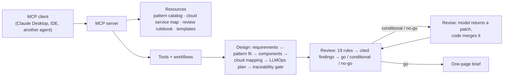

# JD2Agent

JD2Agent reads a job description and builds an agent for the repeatable, checkable parts of the role. The agent
drafts; the person in the role decides. The same engine is next pointed at a team's SOPs and runbooks instead of a
posting ([Phase 5 plan](docs/phase-5-sop-to-agent.md)).

Every agent ships as an **MCP server**. MCP (Model Context Protocol) is an open standard that lets any compatible
client, such as Claude Desktop, an IDE or another agent, call the agent's tools, read its reference data and use its
prompts. One package works in all of them, with no custom integration.

The idea comes from Paper2Agent (Nature, 2026), a research project that turns a scientific paper's methods into an
agent served as an MCP server. JD2Agent does the same for a job.

**Built so far:** four agents from three job postings. A design reviewer whose rulebook swaps per industry, an
evaluator that grades recorded agent runs, a working prior-authorization reviewer, and a planner that decides whether
fine-tuning is worth it.

**First agent:** `ai-architect-agent`, built from a Senior Principal Architect, Applied AI posting at a large
industrial equipment manufacturer (a generic example that fits any similar company). It
designs agentic AI solutions from a business brief, reviews them against a written rulebook, and fixes what the
review finds.

**Live result** (Claude Sonnet 5.5, fictional dealer fault-diagnosis scenario): v1 review **CONDITIONAL (94)**, with
the agent's own design keeping restricted repair history in audit logs. One revision changed the logs to store
evidence IDs instead of content, and the re-review came back **GO (100)**.
→ [`agents/ai-architect/examples/dealer-fault-diagnosis-live/`](agents/ai-architect/examples/dealer-fault-diagnosis-live/)

**Second agent:** `agent-evaluator`, from an Agentic AI Engineer, Healthcare AI posting. Its top-scoring task,
trajectory and task-level evaluation, became a new agent. Design and safety review for that role reuse `ai-architect-agent` with a new healthcare rule pack and no code changes; the live loop reached GO, and the review caught 4 of 4 planted healthcare defects ([example](agents/ai-architect/examples/prior-auth-review-live/)).
It grades recorded agent runs: code decides pass or fail, and the model names the root cause from a fixed list,
quoting the trace steps. On 25 synthetic runs with planted failures it found the planted root cause 90–95% of the time
(three live runs), and every citation checked out. In the demo, version 1.1 of a fictional prior-authorization agent
passes more tasks than 1.0 but gets **NO-GO**: it approves a case that must go to a human reviewer.
→ [`agents/agent-evaluator/`](agents/agent-evaluator/)

**Third agent:** `prior-auth-reviewer`, the working system the other two design and grade. It covers the posting's
retrieval, context-engineering and integration work:
- hybrid retrieval with a reranker, measured stage by stage;
- identifier masking and minimum-necessary context;
- health-plan systems reached as MCP tools, with retries and escalation;
- a proposer, a critic and a code judge that cannot deny.

Live: 12 of 12 cases right, no unsafe approvals. The evaluator graded its real traces and caught a regression
(NO-GO), diagnosed it, and passed the fix (GO).
→ [`agents/prior-auth-reviewer/`](agents/prior-auth-reviewer/)

**Fourth agent:** `customization-planner`, from a Senior Solutions Architect, Agentic AI posting at a GPU and AI
platform company. Its heaviest ask is model customization, so the new agent answers "should we fine-tune?" from an
agent's recorded runs:
- each failure goes to the cheapest fix that can hold it (code, workflow, tool, retrieval, then model judgment);
- SFT examples and DPO preference pairs are built only where code can verify the right answer;
- readiness gates decide whether training is worth it, and a recipe names the regression gate the tuned model must pass.

On the reviewer's 60 real traces (offline, deterministic): 6 model decisions differ from the verified answer, all the
same hedge, which yields 2 unique preference pairs from 2 tasks. Verdict: **not ready to train**; keep the
self-correction round. Architecture reviews for that role reuse `ai-architect-agent` with a new agent-platform rule
pack (tenant isolation, sandboxed tools, latency and serving, customization gate), with no code changes.
→ [`agents/customization-planner/`](agents/customization-planner/)

## How a job description becomes an agent

| Phase | Input → output | Status |
|---|---|---|
| 1. Role spec | Posting → `role_spec.yaml`: tasks cited to the posting, scored on whether an agent can do them and whether the output can be checked | Done |
| 2. Blueprint | Role spec → `blueprint.yaml`: MCP tools, resources, prompts, workflows, evaluation plan | Done |
| 3. Agent | Blueprint → MCP server + LangGraph workflows + 30 tests | Done; live loop reaches GO |
| 4. Demo | Recording, 90-day plan, this repo | In progress |
| 5. Productize | Swap the job description for SOPs and runbooks as input | Planned: [Phase 5 plan](docs/phase-5-sop-to-agent.md) |

Scoring weights checkability highest (30%): an agent whose output can't be verified isn't enterprise-ready.
Tasks score **BUILD** (agent does it), **ASSIST** (agent drafts, human finishes) or **HUMAN** (stays with the person:
roadmap, enterprise deployment, influencing teams).

## How the agent works



**Design rule:** every model output passes a code-based check before it leaves a tool. Requirements must quote the
brief word for word, every requirement must map to a component and every component to a test, and every review
finding must quote the section it cites.

## What building it taught

- **Code can prove evidence exists, not that it was read correctly.** The model marked a 30-second target as
  "latency-sensitive" (defined as a few seconds), which flipped the architecture pattern. The quote check passed;
  explicit thresholds in the catalog fixed it.
- **Ask a model for a patch, not a rewrite.** Regenerating a whole design to fix three findings overran the output
  limit; a patch merged by code is smaller and leaves everything else untouched.
- **Structured-output schemas have provider limits.** Optional fields count against schema complexity; flat,
  all-required schemas (with `""` / `[]` meaning "unchanged") pass.
- **Measure stability.** Four live runs: same pattern, same signals, main finding 4 of 4; borderline review rules
  1–3 of 4.

## Run it

```bash
cd agents/ai-architect
uv sync --extra anthropic --extra dev        # or --extra aws / azure / gcp
uv run python -m unittest discover -s tests -t .
export AI_ARCHITECT_MODEL="anthropic:claude-sonnet-5-5"   # plus the provider's credentials
uv run python -m ai_architect.cli loop --scenario dealer-fault-diagnosis --cloud aws
```

Pipeline scripts (from the repo root): `python -m jd2agent.ingest`, `python -m jd2agent.score`,
`python -m jd2agent.check_blueprint`. Setup details, Claude Desktop config and the job runner:
[`agents/ai-architect/README.md`](agents/ai-architect/README.md).

## Repository

| Path | What it is |
|---|---|
| `jd2agent/` | Pipeline: ingest a posting, score tasks, check a blueprint against its role spec |
| `roles/<role>/` | Role spec and blueprint for each posting |
| `agents/ai-architect/` | First agent: designs and reviews agentic AI architectures |
| `agents/agent-evaluator/` | Second agent: evaluates agent runs, labels failures, gates releases |
| `agents/prior-auth-reviewer/` | Third agent: reviews prior authorization cases (retrieval, context, MCP integrations, proposer/critic/judge) |
| `agents/customization-planner/` | Fourth agent: decides whether failures call for fine-tuning, builds checked SFT and preference data from traces |
