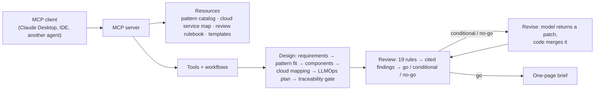

# JD2Agent

Turn a job description into a working agent that does the repeatable parts of the role, packaged as an MCP server
(Tools, Resources, Prompts). Inspired by Paper2Agent (Nature, 2026), which turns research papers into agents.

**First agent:** `ai-architect-agent`, built from a Senior Principal Architect, Applied AI posting at a large
industrial equipment manufacturer (a generic example that fits any similar company). It
designs agentic AI solutions from a business brief, reviews them against a written rulebook, and fixes what the
review finds.

**Live result** (Claude Sonnet 5.5, fictional dealer fault-diagnosis scenario): v1 review **CONDITIONAL (94)**, with
the agent's own design keeping restricted repair history in audit logs. One revision changed the logs to store
evidence IDs instead of content, and the re-review came back **GO (100)**.
→ [`agents/ai-architect/examples/dealer-fault-diagnosis-live/`](agents/ai-architect/examples/dealer-fault-diagnosis-live/)

**Second agent:** `agent-evaluator`, from an Agentic AI Engineer, Healthcare AI posting. Its top-scoring task,
trajectory and task-level evaluation, became a new agent. Design and safety review for that role reuse `ai-architect-agent` with a new healthcare rule pack and no code changes; the live loop reached GO, and the review caught 4 of 4 planted healthcare defects ([example](agents/ai-architect/examples/prior-auth-review-live/)).
It grades recorded agent runs: code decides pass or fail, and the model names the root cause from a fixed list,
quoting the trace steps. On 25 synthetic runs with planted failures it found the planted root cause 90–95% of the time
(three live runs), and every citation checked out. In the demo, version 1.1 of a fictional prior-authorization agent
passes more tasks than 1.0 but gets **NO-GO**: it approves a case that must go to a human reviewer.
→ [`agents/agent-evaluator/`](agents/agent-evaluator/)

## How a job description becomes an agent

| Phase | Input → output | Status |
|---|---|---|
| 1. Role spec | Posting → `role_spec.yaml`: tasks cited to the posting, scored on whether an agent can do them and whether the output can be checked | Done |
| 2. Blueprint | Role spec → `blueprint.yaml`: MCP tools, resources, prompts, workflows, evaluation plan | Done |
| 3. Agent | Blueprint → MCP server + LangGraph workflows + 30 tests | Done; live loop reaches GO |
| 4. Demo | Recording, 90-day plan, this repo | In progress |
| 5. Productize | Swap the job description for SOPs and runbooks as input | Planned: [Phase 5 plan](docs/phase-5-sop-to-agent.md) |

Scoring weights checkability highest (30%): an agent whose output can't be verified isn't enterprise-ready.
Tasks score **BUILD** (agent does it), **ASSIST** (agent drafts, human finishes) or **HUMAN** (stays with the person:
roadmap, enterprise deployment, influencing teams).

## How the agent works



**Design rule:** every model output passes a code-based check before it leaves a tool. Requirements must quote the
brief word for word, every requirement must map to a component and every component to a test, and every review
finding must quote the section it cites.

## What building it taught

- **Code can prove evidence exists, not that it was read correctly.** The model marked a 30-second target as
  "latency-sensitive" (defined as a few seconds), which flipped the architecture pattern. The quote check passed;
  explicit thresholds in the catalog fixed it.
- **Ask a model for a patch, not a rewrite.** Regenerating a whole design to fix three findings overran the output
  limit; a patch merged by code is smaller and leaves everything else untouched.
- **Structured-output schemas have provider limits.** Optional fields count against schema complexity; flat,
  all-required schemas (with `""` / `[]` meaning "unchanged") pass.
- **Measure stability.** Four live runs: same pattern, same signals, main finding 4 of 4; borderline review rules
  1–3 of 4.

## Run it

```bash
cd agents/ai-architect
uv sync --extra anthropic --extra dev        # or --extra aws / azure / gcp
uv run python -m unittest discover -s tests -t .
export AI_ARCHITECT_MODEL="anthropic:claude-sonnet-5-5"   # plus the provider's credentials
uv run python -m ai_architect.cli loop --scenario dealer-fault-diagnosis --cloud aws
```

Pipeline scripts (from the repo root): `python -m jd2agent.ingest`, `python -m jd2agent.score`,
`python -m jd2agent.check_blueprint`. Setup details, Claude Desktop config and the job runner:
[`agents/ai-architect/README.md`](agents/ai-architect/README.md).

## Repository

| Path | What it is |
|---|---|
| `jd2agent/` | Pipeline: ingest a posting, score tasks, check a blueprint against its role spec |
| `roles/<role>/` | Role spec and blueprint for each posting |
| `agents/ai-architect/` | First agent: designs and reviews agentic AI architectures |
| `agents/agent-evaluator/` | Second agent: evaluates agent runs, labels failures, gates releases |
