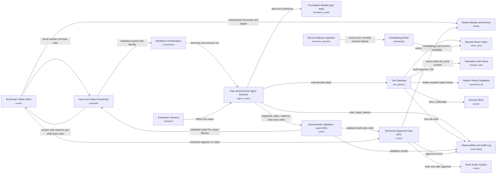

# Dealer Fault Diagnosis: one-page brief

**Final review: GO** (readiness 100/100) after 1 revision round(s).
Pattern: **P5 Plan-and-execute** · cloud: **aws** · 18 components · design v2

**Problem.** When a machine reports a fault code, a dealer technician spends 2–4 hours checking service manuals, recent machine alerts (telematics) and repair history before deciding what to inspect or replace. A wrong first diagnosis means a repeat visit.

**Solution.** The technician enters a machine serial number and fault code on a tablet. Within about 30 seconds, the assistant proposes a likely root cause and next inspection or repair steps, and drafts a work order. Every recommendation links to the manual section, alert or past repair behind it. If evidence is thin, it says so rather than guessing. Manuals are refreshed monthly, and alerts flow in continuously.

**Human control.** The assistant cannot create or close work orders. A draft stays pending until an authorized technician reviews the evidence and approves it. Rejected or unanswered drafts are discarded. Automated checks confirm that every cited source exists and was available to that dealer. Repair history is visible only to the dealer that performed the work. An audit trail, readable only by auditors, records how each recommendation was derived and who approved it. It does not store answer text or repair content. Proposed retention is 24 months.

**Cost.** Assuming 2,000 requests per business day (about 44,000 per month), the cost is roughly $0.056 per request. Including fixed running costs, that is about $3,000–$4,000 per month. Volumes, usage and prices are assumptions to be replaced with actual figures.

**Key risks.**
- Wrong or unsupported diagnoses: mitigated by citation checks and advisory-only status.
- Slow responses: mitigated by time limits, and partial answers are flagged.
- Delayed alert feed: the answer says so and confidence is lowered.
- Outdated manual versions: citations carry the version, and quality is retested after each release.
- Exposure of one dealer's data to another: access is restricted at several points.
- Hidden instructions in manual or alert text: treated as data only.

**Suggested pilot (about 12 weeks, proposed).**
- Weeks 1–4: connect data sources and build a labeled set of past fault cases.
- Weeks 5–8: test offline for diagnosis quality, citation accuracy and speed, and confirm model choice.
- Weeks 9–12: run a limited pilot with a few dealers, review technician feedback and repeat visits, then decide go or no-go.

## Architecture

## Review history
| Version | Decision | Readiness | Findings |
|---|---|---|---|
| v1 | CONDITIONAL | 94 | DAT-02 (major), OPS-03 (minor), CST-02 (minor) |
| v2 | GO | 100 | none |

## What the review made us change
- **DAT-02** (major): Replaced the vague 'handled accordingly' line with explicit retention, redaction, deletion and access rules for confidential data in logs. Any debug capture that includes content is off by default, time-limited and approved.
- **OPS-03** (minor): Added a per-answer technician feedback control (useful or not useful, plus a reason), an escalation-rate metric, and a named owner for production quality (the service operations product owner). Monthly review and drift alerts now route to that owner.
- **CST-02** (minor): Justified the model per step: a smaller, cheaper model for planning and plan revision, and a mid-tier model for synthesis. Revised the cost arithmetic, which stays an estimate, and added a check that the split does not lower quality.

## Key decisions
- ADR-1: Use plan-and-execute as the agent pattern
- ADR-2: Enforce human approval and draft-only write access for work orders
- ADR-3: Enforce dealer-scoped repair history access at the tool gateway and database
- ADR-4: Verify citations with a deterministic validation layer on every LLM output

## Services (aws)
AWS IAM Identity Center + Amazon Cognito, AWS Secrets Manager, Amazon Bedrock, Amazon Bedrock AgentCore Gateway / API Gateway, Amazon Bedrock AgentCore Runtime, Amazon Bedrock Guardrails, Amazon Bedrock evaluations, Amazon CloudWatch + AgentCore Observability, Amazon DynamoDB, Amazon OpenSearch Serverless (or Bedrock Knowledge Bases), Amazon Redshift / Databricks on AWS, Amazon Textract, Amazon Titan / Cohere embeddings on Bedrock, Custom service on Amazon ECS (Fargate) or AWS Lambda, LangGraph or Strands on Bedrock AgentCore / ECS

_Full design: design_v2.md · reviews: review*.md_
