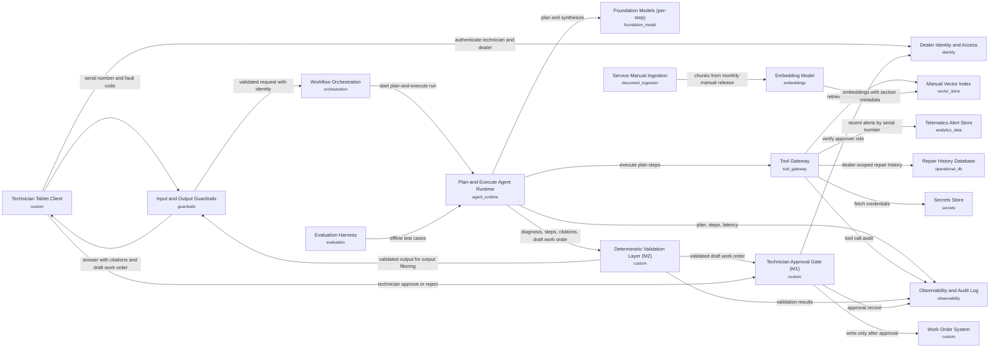

# Dealer Fault Diagnosis (v2)

## Executive Summary

**Problem.** When a machine reports a fault code, a dealer technician spends 2–4 hours checking service manuals, recent machine alerts (telematics) and repair history before deciding what to inspect or replace. A wrong first diagnosis means a repeat visit.

**Solution.** The technician enters a machine serial number and fault code on a tablet. Within about 30 seconds, the assistant proposes a likely root cause and next inspection or repair steps, and drafts a work order. Every recommendation links to the manual section, alert or past repair behind it. If evidence is thin, it says so rather than guessing. Manuals are refreshed monthly, and alerts flow in continuously.

**Human control.** The assistant cannot create or close work orders. A draft stays pending until an authorized technician reviews the evidence and approves it. Rejected or unanswered drafts are discarded. Automated checks confirm that every cited source exists and was available to that dealer. Repair history is visible only to the dealer that performed the work. An audit trail, readable only by auditors, records how each recommendation was derived and who approved it. It does not store answer text or repair content. Proposed retention is 24 months.

**Cost.** Assuming 2,000 requests per business day (about 44,000 per month), the cost is roughly $0.056 per request. Including fixed running costs, that is about $3,000–$4,000 per month. Volumes, usage and prices are assumptions to be replaced with actual figures.

**Key risks.**
- Wrong or unsupported diagnoses: mitigated by citation checks and advisory-only status.
- Slow responses: mitigated by time limits, and partial answers are flagged.
- Delayed alert feed: the answer says so and confidence is lowered.
- Outdated manual versions: citations carry the version, and quality is retested after each release.
- Exposure of one dealer's data to another: access is restricted at several points.
- Hidden instructions in manual or alert text: treated as data only.

**Suggested pilot (about 12 weeks, proposed).**
- Weeks 1–4: connect data sources and build a labeled set of past fault cases.
- Weeks 5–8: test offline for diagnosis quality, citation accuracy and speed, and confirm model choice.
- Weeks 9–12: run a limited pilot with a few dealers, review technician feedback and repeat visits, then decide go or no-go.

## Problem Statement
A heavy-equipment manufacturer's dealer network services engines and machines in the field.
When a machine reports a fault code, a service technician spends 2–4 hours cross-referencing
service manuals, recent telematics alerts, and the machine's repair history before deciding
what to inspect or replace. Repeat visits happen when the first diagnosis is wrong.

The business wants an assistant that, given a machine serial number and fault code, proposes a
likely root cause and the next inspection or repair steps. Every recommendation must cite the
manual section, alert, or past repair it relies on, because technicians and warranty auditors
need to verify it. The assistant must not create or close work orders on its own; a technician
approves any work order it drafts. Technicians use tablets in the field, so answers should come
back within about 30 seconds. Service manuals are updated monthly; telematics arrive continuously;
repair history lives in the dealer business system. Access to repair history is restricted to the
dealer that performed the work.

## Requirements
| ID | Requirement | Source (brief) |
|---|---|---|
| FR-1 | The assistant shall accept a machine serial number and a fault code as input and return a proposed likely root cause. | "given a machine serial number and fault code, proposes a likely root cause and the next inspection or repair steps" |
| FR-2 | The assistant shall propose next inspection or repair steps along with the likely root cause. | "proposes a likely root cause and the next inspection or repair steps" |
| FR-3 | The assistant shall draw on service manuals, recent telematics alerts, and the machine's repair history when producing a diagnosis. | "cross-referencing service manuals, recent telematics alerts, and the machine's repair history" |
| FR-4 | Every recommendation shall cite the manual section, alert, or past repair it relies on. | "Every recommendation must cite the manual section, alert, or past repair it relies on" |
| FR-5 | The assistant shall not create or close work orders on its own; it may only draft work orders, which shall take effect only after technician approval. | "The assistant must not create or close work orders on its own; a technician approves any work order it drafts." |
| FR-6 | The assistant shall restrict access to a machine's repair history to the dealer that performed the work. | "Access to repair history is restricted to the dealer that performed the work." |
| NFR-1 | The assistant shall return answers within about 30 seconds on tablets used in the field. | "Technicians use tablets in the field, so answers should come back within about 30 seconds." |
| NFR-2 | Recommendations shall be verifiable by technicians and warranty auditors through the cited sources. | "technicians and warranty auditors need to verify it" |
| NFR-3 | The solution shall incorporate service manual updates, which occur monthly. | "Service manuals are updated monthly" |
| NFR-4 | The solution shall make use of telematics data that arrive continuously. | "telematics arrive continuously" |

## Pattern Selection
**Selected: P5 Plan-and-execute** (score 3). Modifiers: M1, M2.

| ID | Pattern | Score | Signal contributions |
|---|---|---|---|
| P5 | Plan-and-execute | 3 | open_ended_reasoning +2, audit_required +1 |
| P4 | Single tool-using agent (ReAct) | 2 | open_ended_reasoning +3, audit_required -1 |
| P6 | Supervisor multi-agent | 1 | open_ended_reasoning +1 |
| P2 | Deterministic workflow (prompt chain / graph with fixed steps) | 0 | audit_required +2, open_ended_reasoning -2 |

P5 (Plan-and-execute) ranks first with a score of 3 because it earns +2 for open-ended reasoning (the diagnosis must cross-reference manuals, telematics alerts, and repair history before deciding what to inspect) and +1 for audit_required, since an explicit plan produces a reviewable trail that supports FR-4 and NFR-2 (cited sources that technicians and warranty auditors can verify). P4 (single ReAct agent) ranks second at 2: it gets the largest open-ended reasoning contribution (+3) but takes a -1 penalty on audit_required because its interleaved, improvised tool calls are harder to turn into a verifiable record of what each recommendation relied on. P6 (Supervisor multi-agent) trails at 1 because the inputs show no multiple domains, distinct request types, or many tools to justify the extra coordination. The choice would flip toward P4 if auditability were dropped or relaxed (so its -1 penalty disappeared and its +3 reasoning fit dominated), or if the signals showed truly exploratory diagnosis where a fixed upfront plan keeps breaking; it would move toward P6 only if multiple distinct domains or request types emerged. The inputs do not state latency-sensitivity as a signal, so the roughly 30-second tablet target (NFR-1) is not part of this ranking and should be validated separately.

**Why this pattern rather than a simpler one:** The fault diagnosis requires open-ended cross-referencing across manuals, telematics and repair history, and the steps cannot be known upfront, so a fixed pipeline does not fit. A planner that decides what evidence to gather, followed by controlled execution through a single tool gateway, keeps the reasoning explicit and auditable, and it permits revising the plan when evidence is missing. A single-call retrieval pattern would not cover the multi-source evidence gathering. Approval and validation modifiers are applied because the assistant drafts work orders and audits require verifiable citations.

## Architecture

| ID | Component | Type | Responsibility | Satisfies |
|---|---|---|---|---|
| identity_access | Dealer Identity and Access | identity | Authenticates technicians on tablets and propagates user and dealer identity on every request. Provides the dealer claim used to restrict repair history to the dealer that performed the work. Provides the role claim used to authorize work order approval. | FR-6, FR-5 |
| secrets_store | Secrets Store | secrets | Holds credentials for model endpoints, telematics source, work order system and data stores, so none are embedded in prompts or client code. | FR-6 |
| tablet_client | Technician Tablet Client | custom | Collects machine serial number and fault code, shows the proposed root cause, steps and citations with links to the sources, displays the draft work order, and captures explicit technician approve/reject. Offers a per-answer useful / not useful feedback control with a reason code, sent to the observability component. | FR-1, FR-2, FR-5, NFR-1, NFR-2 |
| input_guardrails | Input and Output Guardrails | guardrails | Checks input formats for serial number and fault code, blocks prompt injection from retrieved text, and filters unsafe or off-scope output before it reaches the user. | FR-1 |
| planner_executor | Plan-and-Execute Agent Runtime | agent_runtime | Planner step produces a diagnostic plan for the serial number and fault code (retrieve manual sections, fetch recent telematics alerts, fetch dealer-scoped repair history, synthesize). Executor runs each step through the tool gateway, may revise the plan when evidence is missing or conflicting, and assembles the root cause, next steps and a drafted work order, each tied to evidence. Step and time budgets are set to fit the response target. | FR-1, FR-2, FR-3, FR-4, NFR-1 |
| llm | Foundation Models (per-step) | foundation_model | Uses a smaller, low-cost model for planning and plan revision, which choose tools and evidence sources and produce short structured output. Uses a mid-tier model for the synthesized diagnosis with citations from retrieved evidence only, using structured output. Both versions are pinned. Planning moves to the mid-tier model if offline evaluation shows the smaller model misses thresholds. | FR-1, FR-2, FR-3, FR-4, NFR-1 |
| orchestrator | Workflow Orchestration | orchestration | Manages the request lifecycle: guardrails, plan execution with timeouts and retries, validation, then the pending-approval state for a drafted work order. Ensures no write occurs before approval. | FR-5, NFR-1 |
| tool_gateway | Tool Gateway | tool_gateway | Single controlled entry for all agent tool calls: manual search, telematics alert lookup, repair history lookup and work order draft. Enforces the caller's dealer scope on repair history queries, logs every call, and exposes only draft-work-order capability. Create/close is available only through the approval path. | FR-3, FR-5, FR-6 |
| manual_ingestion | Service Manual Ingestion | document_ingestion | Runs on each monthly manual release: parses manuals, chunks by section while preserving section identifiers and versions, and refreshes the index. Retains manual version so citations point to the correct edition. | FR-3, FR-4, NFR-3, NFR-2 |
| embedding_model | Embedding Model | embeddings | Embeds manual chunks at ingestion and queries at retrieval time. | FR-3, NFR-3 |
| manual_index | Manual Vector Index | vector_store | Stores manual section embeddings with metadata (manual, version, section id) for retrieval and citation. | FR-3, FR-4, NFR-3 |
| telematics_store | Telematics Alert Store | analytics_data | Receives continuously arriving telematics alerts via streaming ingestion and serves recent alerts by machine serial number with alert ids and timestamps for citation. | FR-3, FR-4, NFR-4 |
| repair_history_db | Repair History Database | operational_db | System of record for repair history, with each record tagged by the dealer that performed the work. Row-level filtering by dealer is enforced at query time. | FR-3, FR-4, FR-6 |
| work_order_system | Work Order System | custom | Existing system of record for work orders. Receives drafts as pending only. Create or close takes effect only after technician approval from the approval gate. | FR-5 |
| approval_gate | Technician Approval Gate (M1) | custom | Holds the drafted work order in pending state and releases the write to the work order system only upon an explicit approval by an authorized technician. Records approver identity, time and the evidence shown. Rejection or timeout discards the draft. | FR-5, NFR-2 |
| validation_layer | Deterministic Validation Layer (M2) | custom | Runs on every LLM output: schema check, citation verification (each cited manual section, alert id or repair record exists, was retrieved in this request, and was accessible to the user's dealer), and rule checks (every recommendation has at least one citation, no work order create/close action issued). Failing outputs are retried once or returned as insufficient evidence. | FR-4, FR-5, FR-6, NFR-2 |
| observability | Observability and Audit Log | observability | Records plan, tool calls, retrieved evidence ids, validation results, latency per step, approvals, and model usage per step. Stores ids, hashes and metadata only, with no raw prompt or output text and no repair history or work order content. Redacts free-text comments, encrypts data, applies a proposed 24-month retention with automatic deletion and a legal-hold exception, and restricts access to the auditor role. Also records technician feedback and escalation outcomes for production quality monitoring. Supports warranty audit review of how each recommendation was derived. | NFR-1, NFR-2, FR-4 |
| evaluation | Evaluation Harness | evaluation | Offline regression on a labeled set of fault cases for diagnosis quality, citation accuracy and latency. Runs on each manual release and on model or prompt changes. | FR-2, FR-4, NFR-2, NFR-3 |

## Tools and Integrations
- Technician Tablet Client: Collects machine serial number and fault code, shows the proposed root cause, steps and citations with links to the sources, displays the draft work order, and captures explicit technician approve/reject. Offers a per-answer useful / not useful feedback control with a reason code, sent to the observability component.
- Tool Gateway: Single controlled entry for all agent tool calls: manual search, telematics alert lookup, repair history lookup and work order draft. Enforces the caller's dealer scope on repair history queries, logs every call, and exposes only draft-work-order capability. Create/close is available only through the approval path.
- Work Order System: Existing system of record for work orders. Receives drafts as pending only. Create or close takes effect only after technician approval from the approval gate.
- Technician Approval Gate (M1): Holds the drafted work order in pending state and releases the write to the work order system only upon an explicit approval by an authorized technician. Records approver identity, time and the evidence shown. Rejection or timeout discards the draft.
- Deterministic Validation Layer (M2): Runs on every LLM output: schema check, citation verification (each cited manual section, alert id or repair record exists, was retrieved in this request, and was accessible to the user's dealer), and rule checks (every recommendation has at least one citation, no work order create/close action issued). Failing outputs are retried once or returned as insufficient evidence.

## Data Sources
| Source | Owner | Freshness | Sensitivity |
|---|---|---|---|
| Service manuals | Manufacturer service documentation team | Updated monthly; re-ingested on each release | internal |
| Telematics alerts | Telematics platform team | Continuous streaming | internal |
| Machine repair history | Dealer that performed the work | Updated as repairs are recorded | confidential |
| Work orders | Service operations (work order system of record) | Real time | confidential |

## Identity and Access
Technicians authenticate through the identity provider; the user ID, role and dealer ID travel with every request. The tool gateway applies the dealer ID as a mandatory filter on repair history, so users see only history for work their dealer performed, and the model never sees other dealers' records. Agent tools use scoped service credentials from the secrets store, not user credentials, but only with the user's dealer scope. The agent holds draft-only permission on work orders. Create or close can only be performed by the approval gate after verifying the approver's technician role. The audit log is readable by the auditor role only, and every read is itself logged. Because the log is treated as confidential data, it is encrypted at rest and in transit, and write access is limited to the observability pipeline's service identity. Deletion and legal-hold changes need a named data steward from service operations.

## Human Oversight
Under M1, the assistant never creates or closes a work order itself. A drafted work order stays pending until a technician explicitly approves it after reviewing the root cause, steps and cited sources. Rejected or timed-out drafts are discarded. Diagnoses are advisory, and technicians and warranty auditors can verify each recommendation through the citations. Approver, time and evidence shown are logged.

## Failure Modes
- Plan is wrong or incomplete: executor revises the plan when evidence is missing, within a step and time budget, and otherwise returns an insufficient-evidence answer rather than a guess.
- Hallucinated or incorrect citation: the validation layer checks that every cited section, alert or repair record exists and was retrieved in this request, and rejects the output otherwise.
- Response exceeds the roughly 30 second target: per-step timeouts, a cap on plan steps, parallel retrieval where steps are independent, and a partial answer with a clear indication of what was not checked.
- Telematics feed delayed or unavailable: answer states that recent alerts could not be checked and lowers confidence in the diagnosis.
- Stale manual content or wrong manual version: citations carry the manual version, ingestion runs on each monthly release, and evaluation re-runs after each update.
- Cross-dealer repair history leakage: the dealer filter is enforced in the tool gateway and database query, and the validation layer rejects citations to records outside the user's dealer scope.
- Unapproved or erroneous work order write: the agent has draft-only permission, and the approval gate is the only path to write.
- Poor connectivity on tablets: the client retries idempotently and resumes a pending request without duplicating drafts.
- Prompt injection through manual or alert text: guardrails treat retrieved content as data, and the tool gateway limits what actions are possible.

## Evaluation
| ID | Test | Kind | Covers | Metric | Threshold |
|---|---|---|---|---|---|
| T1 | Diagnosis quality regression on labeled fault cases | offline_eval | evaluation, planner_executor, llm | Root-cause and next-step agreement with labeled fault cases (serial number + fault code), plus correct insufficient-evidence answers on cases with missing evidence | Proposed: >=85% root-cause agreement and >=95% correct insufficient-evidence handling; no drop of more than 2 points versus the last release. Baseline on first run and adjust. |
| T2 | Citation accuracy and retrieval correctness | offline_eval | llm, manual_index, embedding_model, manual_ingestion, validation_layer | Citation precision (cited manual section, alert or repair record exists, was retrieved, and supports the claim); recall@k of the labeled correct manual section at the correct manual version | Proposed: 100% of citations resolve to retrieved evidence; >=95% support the claim; recall@5 >=90%; citations to the wrong manual edition = 0. Runs on each monthly manual release and on model or prompt changes. |
| T3 | End-to-end latency against the ~30 second target | offline_eval | planner_executor, orchestrator, tool_gateway, telematics_store | p50 and p95 end-to-end latency on the eval set, including cases with a delayed or unavailable telematics feed and a partial-answer fallback | p95 <= 30 seconds; the step cap and per-step timeouts are never exceeded; the partial answer states what was not checked in 100% of the degraded-feed cases |
| T4 | Adversarial and injection safety set | offline_eval | input_guardrails, planner_executor, llm | Block or neutralize rate for prompt injection planted in manual or alert text and for malformed serial numbers or fault codes; off-scope output filter rate | Proposed: 100% of injected instructions not followed; 0 tool calls outside the allowed set; malformed inputs rejected in 100% of cases |
| T5 | Validation layer unit tests | unit | validation_layer | Pass rate of deterministic cases: schema violations, nonexistent or unretrieved citations, citations outside the user's dealer scope, recommendations without citations, and outputs issuing a create/close action; retry once, then insufficient evidence | 100% pass; every bad case is rejected and none is passed through |
| T6 | Tool gateway dealer scope and draft-only unit tests | unit | tool_gateway, repair_history_db, identity_access | Cross-dealer repair history records returned for requests with a different dealer claim; attempts to call create/close work order via the gateway; missing dealer claim handling; every call logged | 0 cross-dealer records at gateway and database query level; 100% of create/close attempts rejected; requests without a dealer claim denied; 100% of calls logged |
| T7 | Approval gate and orchestration write-protection tests | unit | approval_gate, work_order_system, orchestrator, identity_access | Work order writes without approval; approvals by users without a technician role; reject and timeout discard; approver, time and evidence shown recorded; retries and timeouts do not duplicate drafts | 0 writes before explicit approval; 100% of non-technician approvals denied; 100% of rejected or timed-out drafts discarded; 100% of approvals have a complete record |
| T8 | Manual ingestion and index metadata unit tests | unit | manual_ingestion, manual_index, embedding_model | Sample manual release: section ids and manual version preserved on every chunk; index refresh replaces the prior edition correctly; query and chunk embeddings use the same model version | 100% of chunks carry manual, version and section id; 0 stale-edition chunks served after refresh; embedding model version matches between ingestion and retrieval |
| T9 | Tablet client behavior tests | unit | tablet_client, orchestrator | Idempotent retry and resume of a pending request under simulated connectivity loss; citation links resolve to the cited source; approve and reject captured explicitly; no approval by default | 0 duplicate drafts after retries; 100% of citations render with a working link; no approval action is sent without explicit technician input |
| T10 | Secrets hygiene checks | unit | secrets_store, tablet_client, planner_executor | Static scan of prompts, client code and config, plus log sampling, for embedded credentials; check that tool credentials are fetched from the secrets store at call time | 0 credentials found in prompts, client code or logs; 100% of tool calls use credentials from the secrets store |
| T11 | Online monitor: telematics freshness and availability | online_monitor | telematics_store, tool_gateway | Streaming ingestion lag, lookup error rate, and share of answers returned with a 'recent alerts could not be checked' notice | Alert when lag or error rate exceeds the agreed telematics SLO (to be set with the telematics platform team) or when the unchecked-alert share rises above the 7-day baseline |
| T12 | Online monitor: runtime health, validation and audit completeness | online_monitor | observability, validation_layer, planner_executor, llm, orchestrator, input_guardrails, approval_gate, evaluation | Per-step and end-to-end latency p95, validation rejection and insufficient-evidence rate, guardrail block rate, cross-dealer citation rejections, token usage and cost per request, approval and rejection rates, and share of requests with a complete audit record (plan, tool calls, evidence ids, validation, approval) | Alert if p95 latency > 30 seconds, validation rejection rate or insufficient-evidence rate deviates more than 2x from the baseline, any cross-dealer citation rejection occurs (page), cost per request exceeds 1.5x the ~$0.07 estimate, or audit record completeness < 100%. Trigger an offline evaluation re-run on drift. |
| T13 | Audit log content, redaction and retention checks | unit | observability, planner_executor, tool_gateway | Sample of audit records and debug settings: raw prompt or output text, repair history or work order content, or credentials present; free-text comments redacted; retention and deletion job removes records older than the retention period; legal hold respected; access limited to the auditor role | 0 records with raw confidential content; 100% of expired records deleted by the next purge run; 100% of reads by non-auditor roles denied; every audit-log read logged |
| T14 | Online monitor: user feedback, escalation rate and quality owner review | online_monitor | tablet_client, observability, evaluation | Share of answers marked not useful, rejection and abandonment rate, escalation rate after insufficient-evidence answers, feedback response rate, and time to review flagged answers by the quality owner | Alert to the quality owner if not-useful or escalation rate exceeds 2x the 7-day baseline or rises 5 points over the monthly baseline; flagged answers reviewed within 5 business days; trigger an offline evaluation re-run on sustained drift |
| T15 | Per-step model choice comparison | offline_eval | llm, planner_executor, evaluation | On the labeled fault cases, compare planning and revision with the smaller model against the mid-tier model: root-cause agreement, valid plan rate, step count, latency and cost per request | Smaller planning model within 1 point of the mid-tier model on T1 root-cause agreement and plan validity, with no latency regression; otherwise planning reverts to the mid-tier model |

## Observability
- Dashboards for latency per step and end-to-end, validation outcomes, insufficient-evidence rate, guardrail blocks, token usage and cost per request by model tier, approval and rejection rates, technician feedback and escalation rate, all from the observability audit log.
- Alert on any cross-dealer repair history access attempt or any citation outside the user's dealer scope; route to security on-call.
- Alert on any work order write without a matching approval record; reconcile work order system writes against approval gate records daily.
- Telematics feed lag and error alerts; manual ingestion job success and index version check after each monthly release.
- User feedback: the tablet client offers a per-answer 'useful / not useful' control with a reason code and optional comment. The comment is stored as restricted-class data under the log retention rules, and its content is not copied into dashboards. Not-useful answers are queued for review.
- Escalation rate: track the share of diagnoses the technician rejects, abandons or marks not useful, and the share of 'insufficient evidence' answers that end in escalation to a senior technician or manufacturer support. Alert when either deviates more than 2x from the 7-day baseline or rises 5 points over the monthly baseline, and trigger an offline evaluation re-run.
- Quality owner: the service operations product owner for the assistant owns production quality monitoring, reviews feedback and escalation trends weekly, runs the monthly sample review, and decides on rollback or re-evaluation. Security on-call keeps the leakage alerts.
- Sample a set of production diagnoses each month for human review by technicians or auditors, and add the failures to the offline evaluation set. Reviewers see the diagnosis with cited evidence by authorized access, not through exported logs.
- Audit log access is restricted to the auditor role, and access to it is itself logged. Retention and deletion jobs are monitored: alert if purge fails, if any record exceeds the retention period, or if a log redaction check finds raw prompt or repair history text.

Versioning: Keep prompts, planner and synthesis templates, output schemas, validation rules, guardrail configuration, tool definitions and permission scopes, the per-step model assignments, and the model and embedding model identifiers in source control, each with an explicit version. Pin model versions for both the planning model and the synthesis model rather than using floating aliases. Tag each request's audit record with the versions in use (including which model handled each step), plus the manual edition and index version. Any change to a prompt, model, embedding model, tool or validation rule must pass T1-T4 and the unit tests before release, and rolls out in stages with the ability to roll back to the previous version. Each monthly manual release produces a new versioned index that is evaluated (T2, T8) before it is promoted. Changing the embedding model requires a full re-embed of the index. Changes to log retention or content policy are versioned and need approval from the data steward and security.

Governance:
- Draft-only agent permission on work orders; create/close only through the approval gate after verifying the approver's technician role (M1).
- Dealer scope enforced in the tool gateway and in the database query; the model never receives other dealers' repair records.
- Scoped service credentials held in the secrets store; none in prompts or client code.
- Audit log records plan, tool calls, evidence ids, validation results, approvals and model usage; readable only by the auditor role.
- Log content policy (repair history and work orders are confidential): the audit log stores evidence ids, manual section ids and versions, tool call names and parameters, hashes of prompts and outputs, validation results, approvals, token counts and latency. It does not store raw prompts, model outputs, or repair history or work order text. Machine serial numbers and user ids are kept as needed for audit. Free-text technician comments are stripped of personal data and stored under the same retention rules. Content is reconstructed for audit from the source systems by evidence id, which keeps dealer access controls in force.
- Retention: audit records are kept for a proposed 24 months, to be confirmed against warranty audit and legal requirements by service operations and legal, and are then deleted automatically. The same period caps feedback records. Operational telemetry without evidence ids (latency, cost) is kept 13 months. Deletion jobs are logged, and a legal hold can pause deletion for specific records only with data steward approval.
- Debug capture of raw prompts or outputs is off in production. If needed for an incident it is enabled for a limited scope and time by security approval, is encrypted and access-restricted to the auditor and incident roles, and is deleted within 30 days.
- Logs are encrypted at rest and in transit, kept in the same region as the source data, and exempt from cross-dealer sharing. Records covering a dealer's repair history are deleted or reduced to ids on a verified dealer deletion request, subject to legal hold.
- Diagnoses are advisory and each recommendation must carry a verifiable citation, otherwise the answer is insufficient evidence.
- Change control: prompt, model (including the per-step model assignment), tool or permission changes need review and passing evaluation results (T1-T4) before release.
- Data owners (manual documentation team, telematics platform team, dealers, service operations) are named for each data source. Confidential repair history and work order data follow the log content, retention and access rules above.
- Production quality owner: the service operations product owner is accountable for feedback, escalation-rate and drift monitoring, and reports to the change review.
- Periodic access review of roles and dealer claims, and an incident process for any leakage or unapproved write.

## Cost
Assumption: 2,000 diagnostic requests per business day, about 44,000 per month. Model choice per step: planning and plan-revision decisions use a smaller, low-cost model because they only choose among a fixed set of tools and evidence sources and produce short structured output; synthesis with citations uses a mid-tier model because it needs the strongest grounded reasoning. Planning and revision are assumed to total about 3,000 input and 400 output tokens per request, and synthesis about 9,000 input and 1,100 output tokens. Illustrative pricing: smaller model about $0.50 per million input and $2 per million output tokens; mid-tier model about $3 per million input and $15 per million output tokens. That gives roughly $0.0023 for planning and revision plus about $0.044 for synthesis, so about $0.046 LLM cost per request versus about $0.06 with a single mid-tier model. Retrieval, telematics and database queries, orchestration and logging add about $0.01, for roughly $0.056 per request, or about $2,500 per month at 44,000 requests. Fixed monthly costs for the vector index, telematics storage, observability (including log retention under the stated period) and monthly re-ingestion are estimated at a few hundred to about $1,500, so the total is roughly $3,000 to $4,000 per month. The input guardrail format checks (serial number and fault code) are deterministic rules and need no model. If the smaller model lowers T1 or T2 results below threshold, planning moves back to the mid-tier model, with a cost of about $0.01 more per request. Volume, token counts and pricing are assumptions to be replaced with actual figures.

## Platform Mapping
Cloud: **aws**

| Component | Service |
|---|---|
| identity_access | AWS IAM Identity Center + Amazon Cognito |
| secrets_store | AWS Secrets Manager |
| tablet_client | Custom service on Amazon ECS (Fargate) or AWS Lambda |
| input_guardrails | Amazon Bedrock Guardrails |
| planner_executor | Amazon Bedrock AgentCore Runtime |
| llm | Amazon Bedrock |
| orchestrator | LangGraph or Strands on Bedrock AgentCore / ECS |
| tool_gateway | Amazon Bedrock AgentCore Gateway / API Gateway |
| manual_ingestion | Amazon Textract |
| embedding_model | Amazon Titan / Cohere embeddings on Bedrock |
| manual_index | Amazon OpenSearch Serverless (or Bedrock Knowledge Bases) |
| telematics_store | Amazon Redshift / Databricks on AWS |
| repair_history_db | Amazon DynamoDB |
| work_order_system | Custom service on Amazon ECS (Fargate) or AWS Lambda |
| approval_gate | Custom service on Amazon ECS (Fargate) or AWS Lambda |
| validation_layer | Custom service on Amazon ECS (Fargate) or AWS Lambda |
| observability | Amazon CloudWatch + AgentCore Observability |
| evaluation | Amazon Bedrock evaluations |

## Decisions (ADRs)
### ADR-1: Use plan-and-execute as the agent pattern

- **Context:** Diagnosis must cross-reference service manuals, telematics alerts and repair history, and the steps are not known upfront. Every recommendation needs verifiable citations for technicians and warranty auditors. Answers are expected within about 30 seconds on field tablets. The pattern ranking puts plan-and-execute first (score 3), ahead of a single ReAct agent (2) and a supervisor multi-agent (1).
- **Options:** Plan-and-execute: a planner produces an explicit diagnostic plan and an executor runs each step through the tool gateway, revising the plan when evidence is missing; Single tool-using ReAct agent: one loop decides the next tool call at each turn, with no explicit plan; Supervisor multi-agent: a supervisor delegates to specialist agents for manuals, telematics and repair history; Fixed retrieval pipeline: a single retrieval and generation call with no planning step
- **Decision:** Use plan-and-execute (P5). The planner makes the evidence-gathering plan explicit and loggable. The executor runs the steps through the single tool gateway, can revise the plan within step and time budgets, and returns an insufficient-evidence answer rather than guessing. Independent retrieval steps can run in parallel to help meet the response target. The ReAct agent is the simpler alternative with the highest open-ended reasoning fit, but it scores lower on audit and keeps the reasoning implicit. A fixed pipeline does not fit because the evidence needed varies by case. A supervisor multi-agent adds coordination overhead without distinct domains or request types.
- **Consequences:** Positive: the plan, tool calls and evidence ids are auditable, and the reasoning path can be reviewed against cited sources. Negative: the planning call adds latency and token cost, estimated at about 1 planning call plus 2 to 3 synthesis or revision calls per request, so step caps and per-step timeouts are required to stay near 30 seconds. A poor plan is possible, so the executor revision logic and the evaluation harness must cover plan quality.
- **Requirements:** FR-1, FR-2, FR-3, FR-4, NFR-1, NFR-2

### ADR-2: Enforce human approval and draft-only write access for work orders

- **Context:** The assistant must not create or close work orders on its own, and a technician must approve any drafted work order. Work orders are confidential and live in an existing system of record.
- **Options:** Approval gate: the agent has draft-only permission and a separate gate releases the write only after explicit technician approval with role verification; Prompt-level instruction: tell the model not to create or close work orders and give it the normal work order API; Auto-create drafts directly in the work order system and rely on technicians to close or delete unwanted ones afterwards
- **Decision:** Use the approval gate (M1). The tool gateway exposes only draft capability to the agent. Create or close is reachable only through the approval gate, which verifies the approver's technician role through identity and access, records approver, time and evidence shown, and discards rejected or timed-out drafts. The validation layer additionally rejects any output that issues a create or close action. The prompt-only option is the simplest but depends on model compliance and does not guarantee the requirement.
- **Consequences:** Positive: the no-write-before-approval requirement is enforced by permissions and architecture rather than model behavior, and approvals are auditable. Negative: an extra component and an extra technician step in the workflow, plus handling for pending, rejected and timed-out drafts and idempotent retries on poor tablet connectivity.
- **Requirements:** FR-5, NFR-2

### ADR-3: Enforce dealer-scoped repair history access at the tool gateway and database

- **Context:** Repair history is confidential and access is restricted to the dealer that performed the work. The model must not see other dealers' records, and prompt injection from retrieved text is a risk.
- **Options:** Mandatory dealer filter applied by the tool gateway from the authenticated dealer claim and enforced again as row-level filtering at query time, with the validation layer rejecting out-of-scope citations; Instruct the model in the prompt to use only the user's dealer records and filter results after retrieval; Pre-build a separate repair history store or index for each dealer
- **Decision:** Apply the dealer ID from the identity token as a mandatory filter in the tool gateway and in the repair history database query, so out-of-scope records never reach the model. The validation layer also rejects any citation to a record outside the user's dealer scope. Filtering in the prompt or after retrieval was rejected because other dealers' records would already be in model context. Per-dealer stores were rejected as more complex than a row-level filter on the existing system of record.
- **Consequences:** Positive: leakage is prevented before the model sees data, with layered defense and audit logs of every call. Negative: the filter depends on the correctness of the dealer claim and the query layer, so tests for cross-dealer cases are needed in the evaluation harness, and the agent uses scoped service credentials rather than user credentials.
- **Requirements:** FR-6, FR-3, FR-4

### ADR-4: Verify citations with a deterministic validation layer on every LLM output

- **Context:** Every recommendation must cite the manual section, alert or past repair it relies on, and technicians and warranty auditors must be able to verify it. Manuals change monthly, so citations must point to the correct edition.
- **Options:** Deterministic validation layer: schema check, verification that each cited manual section, alert or repair record exists, was retrieved in this request and was accessible to the user's dealer, and a rule that every recommendation has at least one citation, with one retry or an insufficient-evidence response on failure; Prompt the model to cite sources and trust the output, with spot checks in offline evaluation; Use a second LLM as a judge to assess whether citations support the claims
- **Decision:** Use the deterministic validation layer (M2) on every output. Manual chunks carry manual, version and section id, and alerts and records carry ids, so existence and retrieval-in-request can be checked without a model. Failing outputs are retried once or returned as insufficient evidence. Prompt-only citation is the simplest option but does not prevent hallucinated citations. An LLM judge adds cost and latency against the roughly 30 second target and is not deterministic.
- **Consequences:** Positive: fabricated or out-of-scope citations are blocked, and audit logs record the validation results. Negative: the check confirms that cited sources exist and were retrieved, not that they semantically support the claim, so evaluation on labeled fault cases remains necessary for citation accuracy. A retry can add latency.
- **Requirements:** FR-4, NFR-2, NFR-1, NFR-3, FR-6

## Traceability
Requirement coverage 100% · component test coverage 100% · PASSED

| Requirement | Components |
|---|---|
| FR-1 | tablet_client, input_guardrails, planner_executor, llm |
| FR-2 | tablet_client, planner_executor, llm, evaluation |
| FR-3 | planner_executor, llm, tool_gateway, manual_ingestion, embedding_model, manual_index, telematics_store, repair_history_db |
| FR-4 | planner_executor, llm, manual_ingestion, manual_index, telematics_store, repair_history_db, validation_layer, observability, evaluation |
| FR-5 | identity_access, tablet_client, orchestrator, tool_gateway, work_order_system, approval_gate, validation_layer |
| FR-6 | identity_access, secrets_store, tool_gateway, repair_history_db, validation_layer |
| NFR-1 | tablet_client, planner_executor, llm, orchestrator, observability |
| NFR-2 | tablet_client, manual_ingestion, approval_gate, validation_layer, observability, evaluation |
| NFR-3 | manual_ingestion, embedding_model, manual_index, evaluation |
| NFR-4 | telematics_store |

## Revision Log
Version 2. Changes made in response to architecture review findings.

| Round | Rule | Severity | Finding | Change made |
|---|---|---|---|---|
| 1 | DAT-02 | major | Repair history and work orders are classified confidential, and the audit log records plans, tool calls and evidence. The design gives no retention period, no statement on whether prompt and output content is stored or redacted, and no deletion policy. Saying confidential data is 'handled accordingly' does not show that logging complies with the classification. | Replaced the vague 'handled accordingly' line with explicit retention, redaction, deletion and access rules for confidential data in logs. Any debug capture that includes content is off by default, time-limited and approved. |
| 1 | OPS-03 | minor | Latency, validation rates and cost are monitored, and a monthly sample review exists. However, there is no user feedback channel, no escalation-rate metric, and no named owner for production quality monitoring. Only data-source owners and a security on-call route for leakage alerts are named. | Added a per-answer technician feedback control (useful or not useful, plus a reason), an escalation-rate metric, and a named owner for production quality (the service operations product owner). Monthly review and drift alerts now route to that owner. |
| 1 | CST-02 | minor | One 'mid-tier' foundation model is assumed for planning, synthesis and revision calls. No per-step model choice is justified, for example a smaller model for planning or input checks, so the design does not show where smaller models would suffice. | Justified the model per step: a smaller, cheaper model for planning and plan revision, and a mid-tier model for synthesis. Revised the cost arithmetic, which stays an estimate, and added a check that the split does not lower quality. |

## Open Questions
_None._
