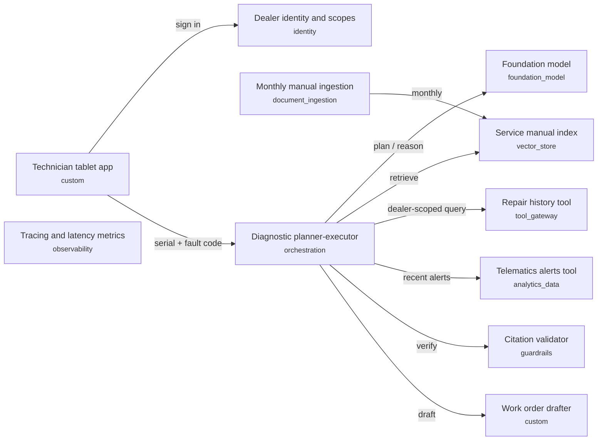

# Dealer Service Fault Diagnosis Assistant

## Executive Summary

Technicians spend hours matching fault codes to manuals, alerts and past repairs. The assistant proposes a likely cause and next steps in about 30 seconds, and every recommendation links to its source so technicians and warranty auditors can check it. It only drafts work orders; a technician approves each one. Estimated cost is about $2,400 a month at 2,000 diagnoses a day. Main risks are gaps in manual coverage and over-trust; we measure accuracy on 200 past cases before rollout. Suggested pilot: 8 weeks with two dealers.

## Problem Statement
A heavy-equipment manufacturer's dealer network services engines and machines in the field.
When a machine reports a fault code, a service technician spends 2–4 hours cross-referencing
service manuals, recent telematics alerts, and the machine's repair history before deciding
what to inspect or replace. Repeat visits happen when the first diagnosis is wrong.

The business wants an assistant that, given a machine serial number and fault code, proposes a
likely root cause and the next inspection or repair steps. Every recommendation must cite the
manual section, alert, or past repair it relies on, because technicians and warranty auditors
need to verify it. The assistant must not create or close work orders on its own; a technician
approves any work order it drafts. Technicians use tablets in the field, so answers should come
back within about 30 seconds. Service manuals are updated monthly; telematics arrive continuously;
repair history lives in the dealer business system. Access to repair history is restricted to the
dealer that performed the work.

## Requirements
| ID | Requirement | Source (brief) |
|---|---|---|
| FR-1 | The assistant shall propose a likely root cause and next inspection or repair steps for a serial number and fault code. | "given a machine serial number and fault code, proposes a likely root cause and the next inspection or repair steps" |
| FR-2 | Every recommendation shall cite the manual section, telematics alert, or past repair it relies on. | "Every recommendation must cite the manual section, alert, or past repair it relies on" |
| FR-3 | The assistant shall only draft work orders; a technician shall approve each one. | "a technician approves any work order it drafts" |
| NFR-1 | Responses shall return within about 30 seconds on field tablets. | "answers should come back within about 30 seconds" |
| NFR-2 | Repair history shall be visible only to the dealer that performed the work. | "Access to repair history is restricted to the dealer that performed the work." |
| NFR-3 | Manual content shall reflect monthly updates. | "Service manuals are updated monthly" |

## Pattern Selection
**Selected: P5 Plan-and-execute** (score 3). Modifiers: M1, M2.

| ID | Pattern | Score | Signal contributions |
|---|---|---|---|
| P5 | Plan-and-execute | 3 | open_ended_reasoning +2, audit_required +1 |
| P4 | Single tool-using agent (ReAct) | 2 | open_ended_reasoning +3, audit_required -1 |
| P6 | Supervisor multi-agent | 1 | open_ended_reasoning +1 |
| P2 | Deterministic workflow (prompt chain / graph with fixed steps) | 0 | audit_required +2, open_ended_reasoning -2 |

P5 Plan-and-execute ranks first because diagnosis depends on intermediate findings and auditors need a reviewable plan. P4 single agent ranks second but loses a point for weaker reproducibility. If the diagnostic procedure were fixed in advance, P2 deterministic workflow would win.

## Architecture

| ID | Component | Type | Responsibility | Satisfies |
|---|---|---|---|---|
| tablet_app | Technician tablet app | custom | Collect serial number and fault code; show cited diagnosis | FR-1, NFR-1 |
| planner | Diagnostic planner-executor | orchestration | Plan lookups, call tools, assemble diagnosis | FR-1, NFR-1 |
| model | Foundation model | foundation_model | Planning and diagnosis reasoning | FR-1 |
| manual_index | Service manual index | vector_store | Retrieve manual sections with section ids | FR-2, NFR-3 |
| manual_ingest | Monthly manual ingestion | document_ingestion | Parse and re-index manuals on each release | NFR-3 |
| repair_history_tool | Repair history tool | tool_gateway | Query dealer repair records with the caller's dealer scope | FR-2, NFR-2 |
| telematics_tool | Telematics alerts tool | analytics_data | Fetch recent alerts for the serial number | FR-1, FR-2 |
| workorder_draft | Work order drafter | custom | Draft a work order for technician approval; never submits | FR-3 |
| citation_check | Citation validator | guardrails | Reject any recommendation whose citation is not in retrieved sources | FR-2 |
| identity | Dealer identity and scopes | identity | Authenticate technicians and carry dealer scope to tools | NFR-2 |
| tracing | Tracing and latency metrics | observability | Trace every model and tool call | NFR-1 |

## Tools and Integrations
- Technician tablet app: Collect serial number and fault code; show cited diagnosis
- Repair history tool: Query dealer repair records with the caller's dealer scope
- Telematics alerts tool: Fetch recent alerts for the serial number
- Work order drafter: Draft a work order for technician approval; never submits

## Data Sources
| Source | Owner | Freshness | Sensitivity |
|---|---|---|---|
| Service manuals | Product support | monthly | internal |
| Telematics alerts | Connected equipment team | streaming | confidential |
| Repair history | Each dealer | daily | restricted |

## Identity and Access
Technicians sign in through the dealer identity provider. The planner passes the technician's dealer scope to every tool; the repair history tool filters records by that scope server-side.

## Human Oversight
The technician approves every drafted work order. Low-confidence diagnoses are flagged for a senior technician.

## Failure Modes
- Model timeout: return retrieved sources without a diagnosis
- Empty retrieval: say no documented cause was found; suggest escalation
- Tool error: continue with remaining sources and mark the gap

## Evaluation
| ID | Test | Kind | Covers | Metric | Threshold |
|---|---|---|---|---|---|
| E1 | Golden diagnoses | offline_eval | planner, model, manual_index, telematics_tool, repair_history_tool | top-1 root cause accuracy vs 200 labeled past cases | >= 75% |
| E2 | Citation accuracy | offline_eval | citation_check, manual_index | share of citations that support the claim | = 100% |
| U1 | Dealer scope enforcement | unit | repair_history_tool, identity | cross-dealer queries return nothing | 0 leaks |
| U2 | Work order never submitted | unit | workorder_draft | submit calls without approval | 0 |
| U3 | Manual re-index | unit | manual_ingest | new manual sections searchable after ingest | 100% |
| M1 | Latency | online_monitor | tablet_app, tracing, planner | p95 end-to-end latency | <= 30 s |

## Observability
- p95 latency and tool error rate per dealer
- Weekly review of technician thumbs-down feedback
- Repeat-visit rate after an assisted diagnosis

Versioning: Prompts, model ids and tool schemas are versioned together; any change re-runs E1 and E2.

Governance:
- Warranty team signs off on citation policy
- Quarterly access review of dealer scopes

## Cost
About $0.04 per diagnosis; about $2,400 per month at an assumed 2,000 diagnoses per day.

## Platform Mapping
Cloud: **aws**

| Component | Service |
|---|---|
| planner | LangGraph or Strands on Bedrock AgentCore / ECS |
| model | Amazon Bedrock |
| manual_index | Amazon OpenSearch Serverless (or Bedrock Knowledge Bases) |
| manual_ingest | Amazon Textract |
| repair_history_tool | Amazon Bedrock AgentCore Gateway / API Gateway |
| telematics_tool | Amazon Redshift / Databricks on AWS |
| citation_check | Amazon Bedrock Guardrails |
| identity | AWS IAM Identity Center + Amazon Cognito |
| tracing | Amazon CloudWatch + AgentCore Observability |

## Decisions (ADRs)
### ADR-1: Plan-and-execute over a single ReAct agent

- **Context:** Diagnoses must be auditable (FR-2) and depend on intermediate findings (FR-1).
- **Options:** Deterministic workflow; Single ReAct agent; Plan-and-execute
- **Decision:** Plan-and-execute, with the plan stored alongside the diagnosis
- **Consequences:** Reviewable plans; slightly higher latency to watch against NFR-1.
- **Requirements:** FR-1, FR-2, NFR-1

### ADR-2: Enforce dealer scope in the tool, not the prompt

- **Context:** Repair history is dealer-restricted (NFR-2).
- **Options:** Instruct the model to filter; Filter server-side in the tool
- **Decision:** Server-side filtering using the caller's identity scope
- **Consequences:** No leakage through prompt injection; tool needs identity propagation.
- **Requirements:** NFR-2

## Traceability
Requirement coverage 100% · component test coverage 100% · PASSED

| Requirement | Components |
|---|---|
| FR-1 | tablet_app, planner, model, telematics_tool |
| FR-2 | manual_index, repair_history_tool, telematics_tool, citation_check |
| FR-3 | workorder_draft |
| NFR-1 | tablet_app, planner, tracing |
| NFR-2 | repair_history_tool, identity |
| NFR-3 | manual_index, manual_ingest |

## Open Questions
- No aws catalog entry for component tablet_app
- No aws catalog entry for component workorder_draft
