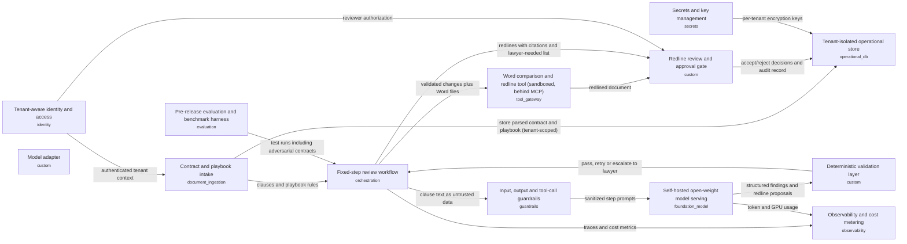

# Isv Contract Review: one-page brief

**Final review: GO** (readiness 100/100) after 2 revision round(s).
Pattern: **P2 Deterministic workflow (prompt chain / graph with fixed steps)** · cloud: **aws** · 13 components · design v3

**The problem.** Our customers' legal teams check incoming supplier contracts against their own rulebooks ("playbooks"). A first review takes a paralegal 1 to 3 hours, and volume peaks at about 4,000 contracts a day across all customers at quarter end.

**The solution.** A review assistant built into our product reads the contract and the customer's playbook, finds each clause the playbook covers, and proposes a marked-up change (a "redline"). Each change cites the playbook rule and the contract clause behind it. Clauses needing a lawyer are listed separately. The design targets a first redline in about 30 seconds typically and within 60 seconds for a 20-page contract. These are design targets, not yet measured.

**How people stay in control.** A member of the customer's legal team must accept or reject every redline, and only accepted changes reach the final document. The system never sends anything to the counterparty. All output is labeled as artificial intelligence (AI) generated, and every screen has an "Escalate to a lawyer" button. Automated checks confirm that every cited rule and quoted clause really exists. Anything that fails is sent to a lawyer, not shown as a finding.

**Cost.** Models run on our own servers, so contract content never goes to an outside service. Planning assumptions, to be validated, are about $0.15 to $0.35 per contract. At 1,000 contracts a day that is roughly $4,500 to $10,500 a month, plus a fixed reserved-capacity cost for quarter-end peaks, reported separately.

**Key risks.**
- Contracts that hide instructions to the assistant. Contract text is treated as data only, and we will test this with adversarial contracts.
- Data leaking between competing customers. Everything is isolated per customer and tested.
- Missed clauses or wrong citations. These are measured, and reviewers see unmatched sections.
- Reviewer fatigue and quarter-end slowdowns, which are monitored.

**Suggested pilot (about 12 weeks).**
- Weeks 1 to 4: build a lawyer-labeled test set and baseline measurements, using mock data.
- Weeks 5 to 8: run the security evaluation, including adversarial and cross-customer leakage tests, and fix the model and server sizing.
- Weeks 9 to 12: limited pilot with a few customers, then a go/no-go decision on measured accuracy, speed and cost.

## Architecture

## Review history
| Version | Decision | Readiness | Findings |
|---|---|---|---|
| v1 | NO-GO | 74 | DAT-02 (major), OPS-03 (minor), CST-02 (minor), AP-01 (major), AP-02 (major), AP-04 (blocker), AP-05 (major), AP-08 (minor) |
| v2 | CONDITIONAL | 96 | RAI-01 (major) |
| v3 | GO | 100 | none |

## What the review made us change
- **DAT-02** (major): Stated retention, deletion and redaction for restricted prompt/output payloads, traces and the audit trail, with named access rules and a retention monitor (T16). Also made serving caches, any retrieval index and logs tenant-scoped, and stated that no prompt or tuning dataset mixes tenants (AP-03). Updated identity_access, obs, monitoring and governance.
- **OPS-03** (minor): Named the contract-review product engineering team (on-call rotation) as owner of production quality and alert response, with a product-legal quality reviewer for accept/reject and escalation trends. Added an alert-routing test (T19) and updated monitoring and governance.
- **CST-02** (minor): Justified the model per step: a small quantized open-weight model for clause identification and a mid-size model for comparison and redline drafting. The validator uses no model. A step is downsized or upsized based on T1/T15/T18 results. Also stated that fine-tuning is not planned and would need evaluation evidence, consented verified data and a held-out benchmark pass (AP-07). Updated llm and failure_modes.
- **AP-01** (major): Added p50 and p95 budgets per step and end to end (p50 <= 30 s, p95 <= 60 s to first redline). Stated that per-clause steps run in parallel and which model size serves each step. Added a per-step latency test (T15) and updated workflow and llm.
- **AP-02** (major): Added a serving plan: the self-hosted cluster is the only place contract content is served (Bedrock is not used for it), planning peak requests and tokens per second, batching, concurrency, autoscaling and quantization, and cost per contract at average and peak load. Added a benchmark gate (T18) that runs before and after any change to model, size, quantization, prompt or serving setup and blocks on a task-success drop or safety failure (AP-06). Updated cost_estimate, versioning and eval.
- **AP-04** (blocker): Described the comparison tool as running in an isolated sandbox: no network egress by default, a task-scoped ephemeral file system, CPU, memory and wall-clock limits, and a runtime-enforced allow-list of tools and hosts. Added sandbox tests (T13) and updated compare_tool, identity_access and governance.
- **AP-05** (major): Made guardrails a separate layer at the input, the output and each tool call, covering jailbreak/injection, personal data, topic and safety. Added an evaluation (T14) measuring block rate and false-block rate on the evaluation set, and updated guardrails and monitoring.
- **AP-08** (minor): Added a model adapter component so the model provider can change without rewriting the agent. Put the comparison tool behind a standard MCP tool interface and kept workflow logic framework-neutral. Added contract tests (T17) and updated workflow and compare_tool.
- **RAI-01** (major): Added a monitor test (T20) that checks every finding and redline shown in the UI carries the AI disclosure and the human-contact link, and alerts if any is missing.

## Key decisions
- ADR-1: Use a deterministic fixed-step workflow instead of an autonomous agent or a no-LLM rules engine
- ADR-2: Serve open-weight models on the vendor's own GPU cluster with a fixed model and bounded token budget
- ADR-3: Validate every LLM output deterministically and gate all changes behind human approval
- ADR-4: Enforce tenant isolation through tenant ID binding, per-tenant keys and storage rather than shared infrastructure with logical filtering only

## Services (aws)
AWS IAM Identity Center + Amazon Cognito, AWS Secrets Manager, Amazon Bedrock, Amazon Bedrock AgentCore Gateway / API Gateway, Amazon Bedrock Guardrails, Amazon Bedrock evaluations, Amazon CloudWatch + AgentCore Observability, Amazon DynamoDB, Amazon Textract, Custom service on Amazon ECS (Fargate) or AWS Lambda, LangGraph or Strands on Bedrock AgentCore / ECS

_Full design: design_v3.md · reviews: review*.md_
