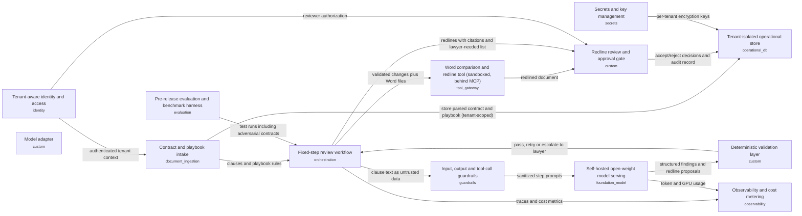

# Isv Contract Review (v2)

## Executive Summary

**The problem.** Customers' legal teams check each incoming supplier contract against their own rulebook (the "playbook"). A first review takes a paralegal 1–3 hours, and volume peaks at about 4,000 contracts a day at quarter end across all customers.

**The solution.** A review assistant inside our product reads the contract and the customer's playbook and finds the clauses the playbook covers. It compares each clause with the playbook position and proposes a tracked-changes edit (a "redline"). Every proposal cites the playbook rule and the contract clause behind it. Clauses needing a lawyer are listed separately. The steps are fixed, not open-ended. That keeps cost and speed predictable and gives attackers less to exploit. The design targets a first redline within 30 seconds typically and 60 seconds at worst for a 20-page contract. This is a design target that testing must still prove.

**How people stay in control.** A person on the customer's legal team must accept or reject every redline, and each decision is recorded under their name. Automatic checks confirm that every cited rule and quoted clause really exists. Anything that fails is sent to a lawyer, never shown as a finding. The system cannot send anything to the other party.

**Confidentiality.** Models run only on our own graphics processing unit (GPU) servers in our cloud, never through an outside service. Each customer's data, keys and temporary memory are kept separate, because some customers compete.

**Cost (estimates, not measurements).** About $0.15–$0.35 per contract. At 1,000 contracts a day, that is roughly $4,500–$10,500 a month in variable cost. Reserved server capacity for quarter-end peaks is a separate fixed cost, to be sized in testing.

**Key risks.** Contracts that try to instruct the assistant, wrong citations, missed clauses, cross-customer data leakage, quarter-end slowdowns and reviewer fatigue. Each has a specific safeguard and a test. The design does not pool customer data to train models.

**Suggested pilot (proposed timeline).**
- Weeks 1–4: build lawyer-labeled test contracts and the documented evaluation, including hostile contracts.
- Weeks 5–8: internal testing; security approval gate.
- Weeks 9–12: limited customer pilot, measuring accuracy, speed and actual cost per contract.

## Problem Statement
An enterprise software vendor sells a contract lifecycle management product to about 300 corporate customers. Its
customers' legal teams review incoming supplier contracts against their own playbooks: which clauses are acceptable,
which need a fallback position, and which must go to a lawyer. A first review takes a paralegal 1–3 hours per
contract, and volume spikes to about 4,000 contracts a day across all customers at quarter end.

The vendor wants to ship a contract review agent inside the product. Given a contract and the customer's playbook,
it finds each clause the playbook covers, compares it with the playbook position, proposes a redline with the
playbook rule it applies, and lists clauses that need a lawyer. A comparison tool runs Python on the uploaded Word
files to produce the redlined document. The agent never sends anything to the counterparty; a person on the
customer's legal team accepts or rejects every redline. Every proposed change must cite the playbook rule and the
contract clause it relies on.

Each customer's contracts and playbooks are confidential to that customer, and several customers compete with each
other. The vendor wants to serve open-weight models on its own GPU cluster to control cost and keep data in its
cloud, and its machine learning team proposes fine-tuning a model on redlines that customers accepted. Product
management wants the first redline back within 60 seconds for a 20-page contract, and a cost per contract the
pricing team can plan around. The vendor's security team will not approve release without a documented evaluation,
including adversarial contracts that try to instruct the agent.

## Requirements
| ID | Requirement | Source (brief) |
|---|---|---|
| FR-1 | The agent shall accept a contract and the customer's playbook as inputs for review. | "Given a contract and the customer's playbook," |
| FR-2 | The agent shall identify each clause in the contract that the playbook covers. | "it finds each clause the playbook covers" |
| FR-3 | The agent shall compare each identified clause with the corresponding playbook position. | "compares it with the playbook position" |
| FR-4 | The agent shall propose a redline for each clause that departs from the playbook, stating the playbook rule applied. | "proposes a redline with the" |
| FR-5 | The agent shall list the clauses that need a lawyer. | "lists clauses that need a lawyer" |
| FR-6 | The system shall use a comparison tool that runs Python on the uploaded Word files to produce the redlined document. | "A comparison tool runs Python on the uploaded Word" |
| FR-7 | The agent shall not send any content to the counterparty. | "The agent never sends anything to the counterparty" |
| FR-8 | The system shall require a person on the customer's legal team to accept or reject every redline. | "accepts or rejects every redline" |
| FR-9 | Every proposed change shall cite both the playbook rule and the contract clause it relies on. | "Every proposed change must cite the playbook rule and the" |
| NFR-1 | The system shall keep each customer's contracts and playbooks confidential to that customer, including isolation between customers that compete with each other. | "Each customer's contracts and playbooks are confidential to that customer" |
| NFR-2 | The agent shall return the first redline within 60 seconds for a 20-page contract. | "the first redline back within 60 seconds for a 20-page contract" |
| NFR-3 | The system shall handle quarter-end peak volume of about 4,000 contracts a day across all customers. | "volume spikes to about 4,000 contracts a day across all customers at quarter end" |
| NFR-4 | The system shall serve open-weight models on the vendor's own GPU cluster, keeping data in the vendor's cloud. | "The vendor wants to serve open-weight models on its own GPU cluster to control cost and keep data in its" |
| NFR-5 | The system shall have a cost per contract that is predictable enough for the pricing team to plan around. | "a cost per contract the" |
| NFR-6 | A documented evaluation shall be completed before release, as required by the security team for approval. | "will not approve release without a documented evaluation," |
| NFR-7 | The evaluation shall include adversarial contracts that try to instruct the agent, and the agent shall resist such instructions. | "including adversarial contracts that try to instruct the agent." |

## Pattern Selection
**Selected: P2 Deterministic workflow (prompt chain / graph with fixed steps)** (score 5). Modifiers: M1, M2.

| ID | Pattern | Score | Signal contributions |
|---|---|---|---|
| P2 | Deterministic workflow (prompt chain / graph with fixed steps) | 5 | steps_known_upfront +3, audit_required +2 |
| P0 | No LLM (conventional automation) | 0 | - |
| P3 | Router | 0 | - |
| P5 | Plan-and-execute | 0 | steps_known_upfront -1, audit_required +1 |

P2 ranks first (score 5) because two signals favor it: the steps are known upfront (+3), since the requirements spell out a fixed sequence of find clause, compare to playbook, propose a redline, and flag for a lawyer (FR-2 to FR-5), and audit is required (+2), because every change must cite the playbook rule and contract clause (FR-9). A fixed chain or graph also makes each step easy to log, evaluate and test against adversarial contracts (NFR-6, NFR-7), and it keeps the Python comparison tool and the human accept/reject gate as set points in the flow (FR-6, FR-8). The runner-up, P0 (No LLM), scores 0 because the rules_suffice signal is false: the inputs are free-text contracts and playbooks, which conventional automation cannot read and compare. P3 (Router) also scores 0 and is not a closer contender, since there are no distinct request types to route between. The choice would flip toward P0 if the playbooks became structured rules that deterministic logic could apply without an LLM, and toward a more dynamic pattern if the steps stopped being known upfront and open-ended reasoning was needed, though neither is indicated by the current inputs.

**Why this pattern rather than a simpler one:** The steps are known up front (find covered clauses, compare, propose a redline with citations, list lawyer-needed clauses, generate the redline, human review), so no open-ended reasoning or dynamic tool selection is needed. A fixed workflow gives a predictable cost per contract and latency, makes each step testable and auditable, and limits the prompt-injection attack surface compared with an autonomous agent.

## Architecture

| ID | Component | Type | Responsibility | Satisfies |
|---|---|---|---|---|
| identity | Tenant-aware identity and access | identity | Authenticates users on the customer's legal team and carries a tenant ID on every request, job, storage key and model call. Enforces per-customer authorization so competing customers are never co-mingled. | NFR-1, FR-8 |
| ingestion | Contract and playbook intake | document_ingestion | Accepts the uploaded Word contract and the customer's playbook. Parses them into clauses and structured playbook rules, keeping clause location references and storing originals in tenant-scoped storage. | FR-1, FR-2 |
| workflow | Fixed-step review workflow | orchestration | Runs the fixed chain: intake, clause identification against the playbook, comparison, redline proposal with rule and clause citations, lawyer-escalation list, validation, comparison tool, then approval gate. Queues jobs and fans out the per-clause identification and comparison/redline steps in parallel. Intake, validation, the comparison tool and the approval gate run sequentially. Latency budgets to first redline (p50 / p95, in seconds): queue wait 2 / 5, intake parsing 3 / 6, clause identification 6 / 12, comparison and redline drafting 12 / 25, validation 1 / 3, sandboxed comparison tool 3 / 6. Guardrail overhead is inside each step. End to end this gives p50 <= 30 s and p95 <= 60 s for a 20-page contract, so the quarter-end peak is absorbed. Workflow logic is framework-neutral: it calls models only through the model adapter and tools only through the MCP interface, so the orchestration framework can change without rewriting the agent. | FR-2, FR-3, FR-4, FR-5, NFR-2, NFR-3 |
| llm | Self-hosted open-weight model serving | foundation_model | Serves open-weight models on the vendor's own GPU cluster in the vendor's cloud. Contract content is never sent to a managed model API. Clause identification uses a small quantized model because it is a bounded matching and extraction task, and the larger model is used only if T1 recall misses its threshold. Comparison and redline drafting use a mid-size model because they need legal reasoning and accurate citation. Per-tenant prefix and KV caches only. Uses continuous batching, a per-replica concurrency cap and queue-depth autoscaling with a warm baseline. A fixed model and bounded token budget per step keep cost per contract predictable. Quantization and model size changes are accepted only after the T18 benchmark. | NFR-4, NFR-2, NFR-3, NFR-5, FR-3, FR-4 |
| guardrails | Input, output and tool-call guardrails | guardrails | A separate layer, independent of the model and workflow, that runs at the input, the output and each tool call. It checks for jailbreak and prompt injection, personal data, off-topic requests and unsafe content. Treats contract text strictly as untrusted data, never as instructions, using delimiters and an instruction-isolating prompt design. Blocks any output that is not a structured finding, and blocks tool calls outside the allow-list. Blocked items are routed to lawyer review, not silently dropped. Block rate and false-block rate are measured on the evaluation set (T14) and monitored online. The workflow has no outbound channel to the counterparty. | NFR-7, FR-7 |
| validator | Deterministic validation layer | custom | Runs on every LLM output. Performs schema checks and verifies that each cited playbook rule ID exists in the tenant's playbook. Verifies that each cited contract clause exists and that quoted text matches the source verbatim. Applies rule checks, for example that every redline names a rule and that the clauses flagged for a lawyer are listed. Rejects or retries failing outputs, and routes repeated failures to lawyer review. | FR-9, FR-4, FR-5 |
| compare_tool | Word comparison and redline tool (sandboxed, behind MCP) | tool_gateway | Exposed through a standard MCP tool interface and the only tool the workflow calls. Runs Python on the uploaded Word files to generate the redlined document from the validated proposed changes, inside an isolated sandbox: no network egress by default, a file system scoped to the current task and tenant and deleted when the job ends, CPU, memory and wall-clock limits, and a tool and host allow-list enforced by the sandbox runtime, not by the prompt. The job fails closed on any limit breach or blocked call, and nothing is partially applied. | FR-6, FR-7, NFR-1 |
| approval_ui | Redline review and approval gate | custom | Presents each redline with its cited playbook rule and contract clause, plus the list of clauses needing a lawyer. A legal-team member must accept or reject every redline. Only accepted changes are written to the final document or system of record. Nothing is sent to the counterparty by the system. | FR-8, FR-7, FR-5, FR-9 |
| store | Tenant-isolated operational store | operational_db | Stores contracts, playbooks, findings, redlines, reviewer decisions and the audit trail. Uses per-tenant partitioning and encryption keys, with row-level or storage-level isolation between customers. | NFR-1, FR-8, FR-9 |
| secrets | Secrets and key management | secrets | Holds service credentials and per-tenant encryption keys. Nothing is embedded in prompts or code. | NFR-1 |
| eval | Pre-release evaluation and benchmark harness | evaluation | Produces the documented evaluation required for security approval. It covers clause-detection and redline quality against lawyer-labeled contracts, citation accuracy, per-step and end-to-end latency, cross-tenant leakage tests, guardrail block and false-block rates, and sandbox tests. It includes adversarial contracts that try to instruct the agent, with pass/fail thresholds. It also runs a reproducible benchmark (task success, latency, throughput, cost per task) before and after any change to model, model size, quantization, prompt or serving setup. A drop in task success or a safety failure blocks the change. | NFR-6, NFR-7, NFR-2 |
| obs | Observability and cost metering | observability | Traces each workflow step and records per-step latency, tokens, GPU time, validation failures, guardrail blocks and queue depth, and attributes cost per contract and per tenant. Traces carry metadata only, and contract content is redacted by default and never logged outside the tenant boundary. Payloads kept for debugging stay in the tenant's store for at most the stated retention period, and reads are audit-logged. Alerts on SLA, cost, retention and sandbox drift are routed to the contract-review product engineering team on-call. | NFR-5, NFR-2, NFR-3 |
| model_adapter | Model adapter | custom | A single interface between the workflow and the serving layer. It carries tenant ID, per-step model selection, token budgets and structured-output schemas. It lets the model provider or serving stack change without rewriting the agent logic. It is covered by contract tests. | NFR-4, NFR-5 |

## Tools and Integrations
- Deterministic validation layer: Runs on every LLM output. Performs schema checks and verifies that each cited playbook rule ID exists in the tenant's playbook. Verifies that each cited contract clause exists and that quoted text matches the source verbatim. Applies rule checks, for example that every redline names a rule and that the clauses flagged for a lawyer are listed. Rejects or retries failing outputs, and routes repeated failures to lawyer review.
- Word comparison and redline tool (sandboxed, behind MCP): Exposed through a standard MCP tool interface and the only tool the workflow calls. Runs Python on the uploaded Word files to generate the redlined document from the validated proposed changes, inside an isolated sandbox: no network egress by default, a file system scoped to the current task and tenant and deleted when the job ends, CPU, memory and wall-clock limits, and a tool and host allow-list enforced by the sandbox runtime, not by the prompt. The job fails closed on any limit breach or blocked call, and nothing is partially applied.
- Redline review and approval gate: Presents each redline with its cited playbook rule and contract clause, plus the list of clauses needing a lawyer. A legal-team member must accept or reject every redline. Only accepted changes are written to the final document or system of record. Nothing is sent to the counterparty by the system.
- Model adapter: A single interface between the workflow and the serving layer. It carries tenant ID, per-step model selection, token budgets and structured-output schemas. It lets the model provider or serving stack change without rewriting the agent logic. It is covered by contract tests.

## Data Sources
| Source | Owner | Freshness | Sensitivity |
|---|---|---|---|
| Customer contracts (Word files) | Each customer | Uploaded per review request | restricted |
| Customer playbooks | Each customer's legal team | Customer-maintained; the version in effect at review time is recorded with each result | restricted |
| Review findings, redlines and reviewer decisions (audit trail) | Vendor, on behalf of each customer | Written in real time during the review | confidential |

## Identity and Access
Users on the customer's legal team authenticate through the identity component. The tenant ID is bound to every request, job, storage path, encryption key, cache key and model invocation. Cross-tenant access is denied by default. There are no shared caches, shared prompts, shared retrieval indexes or cross-tenant context between customers, including competitors. Any prefix or KV cache on the serving layer is keyed per tenant and never shared across tenants. No prompt set or tuning dataset mixes tenants. The service identity is least-privilege and scoped per tenant. The comparison tool runs in an isolated sandbox with no default network egress, and its file system is limited to the current job's tenant files. Only authorized legal-team members can accept or reject redlines, and each decision is attributed to a named user. Prompt and output payloads, traces and the audit trail are restricted data held in the tenant's store. They are readable only by the tenant's authorized users and by named vendor operators under a logged, time-boxed break-glass grant. Every read of this data is itself audit-logged.

## Human Oversight
Every redline must be explicitly accepted or rejected by a person on the customer's legal team (M1 approval gate) before any change is applied to the document of record. Clauses needing a lawyer are listed separately and are never auto-resolved. Output that fails deterministic validation (M2) is not shown as a finding and is instead escalated for lawyer review. The system never sends anything to the counterparty. Sending remains a manual human action outside the system.

## Failure Modes
- Prompt injection in a contract that tries to instruct the agent: contract text is treated as data, the separate guardrails layer and structured-output validation apply, and the adversarial evaluation covers it.
- Hallucinated or incorrect citation: the validator checks that the playbook rule ID and verbatim clause text exist, and a failure triggers a retry and then escalation to a lawyer.
- Missed clause that the playbook covers: the reviewer is shown all identified clauses and unmatched sections, and the evaluation measures recall.
- Small model used for clause identification misses clauses: T1 recall is measured for this step, a result below threshold moves the step to the larger model, and the reviewer still sees unmatched sections.
- Cross-tenant data leakage, including through serving caches: tenant-scoped storage, keys, caches and calls, with leakage tests in the evaluation.
- Quarter-end spike pushes latency past 60 s: queueing, per-clause parallelism and GPU autoscaling on queue depth, with alerts. Baseline GPU capacity is pre-provisioned for the peak plan ahead of quarter end.
- GPU cluster or model-serving outage: jobs stay queued and are retried, users see a delayed-status message, and nothing is partially applied.
- Malformed or unsupported Word file (tracked changes, corrupt, scanned): intake validation rejects it with a clear message and does not guess.
- Malicious or malformed Word file tries to exhaust resources or reach the network from the comparison tool: the sandbox enforces CPU, memory and time limits and default-deny egress, the job fails closed, and nothing is partially applied.
- Comparison tool error producing a wrong redlined document: the tool output is checked against the validated change list and shown to the reviewer before acceptance.
- Guardrails over-block legitimate contract text or miss personal data: block and false-block rates are measured in T14 and monitored online, and blocked items go to lawyer review rather than being dropped.
- Reviewer approval fatigue: the UI shows the rule and clause side by side, and decision statistics are monitored by the named owner.
- Model, model size, quantization, prompt or serving change degrades quality: the benchmark gate (T18) and evaluation harness run before and after every change, and a task-success drop or safety failure blocks release.
- Retained prompt or trace data outlives its retention period: the retention monitor (T16) alerts on any restricted payload older than policy.

## Evaluation
| ID | Test | Kind | Covers | Metric | Threshold |
|---|---|---|---|---|---|
| T1 | Clause detection and redline quality vs lawyer-labeled contracts | offline_eval | ingestion, workflow, llm | Dataset: lawyer-labeled contracts with their playbooks, including unmatched sections. Metric: clause-detection recall and precision, and share of redlines a lawyer rates acceptable. | Proposed, to be confirmed at security approval: recall >= 0.95, precision >= 0.90, acceptable redlines >= 85%. No regression versus the current release. |
| T2 | Citation accuracy | offline_eval | llm, validator | Dataset: the T1 set. Metric: share of cited playbook rule IDs and clause references that exist, and share of quoted text that matches the source verbatim, measured both before and after validation. | Citations shown to reviewers: 100% valid after validation. Raw model citation validity >= 95%, so retries stay within the capped count. |
| T3 | Adversarial contracts (prompt injection and egress) | offline_eval | guardrails, llm, workflow, compare_tool | Dataset: adversarial contracts with embedded instructions (override playbook, exfiltrate other data, call outside tools, emit non-finding output). Metric: share of attacks that leave no behavior change, no non-structured output and no egress attempt. | 0 successful attacks. 100% of non-structured outputs blocked. |
| T4 | Cross-tenant leakage tests | offline_eval | identity, store, secrets, llm, compare_tool | Dataset: paired synthetic tenants, including competitors, with planted canary strings in contracts and playbooks. Metric: canary appearances in another tenant's requests, storage reads, model context, tool file access, caches or outputs, and cross-tenant key use. | 0 leaks. All cross-tenant access attempts denied. |
| T5 | Latency and peak-load test | offline_eval | workflow, llm | Dataset: 20-page contracts replayed under a simulated quarter-end load (about 4,000 contracts a day). Metric: time to first redline, p95. | p95 <= 60 s at peak load. Jobs queue and retry without partial application during a simulated serving outage. |
| T6 | Validator unit tests | unit | validator | Pass rate of deterministic cases: schema violations, nonexistent or other-tenant rule IDs, nonexistent clauses, non-verbatim quotes, redlines without a rule, missing lawyer-needed list, retry cap, escalation after repeated failure. | 100% pass. Any failing output is rejected, never shown as a finding. |
| T7 | Intake parsing unit tests | unit | ingestion | Pass rate on Word fixtures: clause splitting, location references, playbook rule parsing, tenant-scoped storage keys, and rejection of corrupt, scanned or tracked-changes files with a clear message. | 100% pass. Unsupported files are never partially processed. |
| T8 | Comparison tool unit tests | unit | compare_tool | Pass rate: the generated redline contains exactly the validated change list and nothing else. File access is limited to the current tenant. Outbound network calls are blocked. | 100% pass. 0 differences between the output and the validated change list. |
| T9 | Access, approval gate and secrets unit tests | unit | identity, approval_ui, secrets | Pass rate: tenant ID on every request, job, storage key and model call. Cross-tenant access denied by default. Only authorized users can decide. Every redline needs an explicit decision before write. Decisions are attributed to a named user. A scan finds no secrets in code or prompts. | 100% pass. 0 secrets found. 0 changes written without an explicit accept. |
| T10 | SLA, queue and cost monitor | online_monitor | obs, workflow, llm, store | Per-step and end-to-end latency, queue depth, GPU utilization and autoscaling, tokens and GPU time per contract and per tenant, and store errors. Contract content is not logged outside the tenant boundary. | Alert when p95 time to first redline approaches 60 s, when queue depth is sustained, or when cost per contract drifts above the $0.15-$0.35 assumption. These are assumptions to be validated. |
| T11 | Validation and reviewer behavior monitor | online_monitor | validator, approval_ui, guardrails | Validation failure and retry rate, escalation rate, injection-detection and blocked-output counts, accept/reject ratio, and decision time per reviewer. | Alert on a step change from the baseline set in the T1/T2 evaluation. Review reviewer decision-time and accept-rate outliers as an approval-fatigue signal. |
| T12 | Evaluation release gate | unit | eval | CI check that any model, prompt or tool version change triggers T1-T5 and that results are stored as the documented evaluation. Release is blocked on any failed threshold. | 100% of changes gated. Evaluation report archived for every release. |
| T13 | Comparison tool sandbox tests | unit | compare_tool | Pass rate on sandbox cases: outbound network calls denied by default, file access outside the task directory denied, calls to non-allow-listed tools or hosts rejected by the runtime even when the prompt asks for them, CPU, memory and time-limit breaches terminate the job, and the ephemeral file system is removed after the job. | 100% pass. 0 egress or out-of-scope file access succeeds. Limit breaches fail closed with nothing partially applied. |
| T14 | Guardrail block and false-block rates | offline_eval | guardrails | Dataset: the T1 set plus the T3 adversarial set, plus labeled cases for personal data, off-topic and unsafe content, run at input, output and tool-call points. Metric: block rate on bad cases and false-block rate on legitimate contract text, per category. | Proposed, to be confirmed at security approval: block rate >= 0.99 for injection and out-of-allow-list tool calls, >= 0.95 for personal-data, topic and safety cases, and false-block rate <= 0.02 on legitimate contract text. |
| T15 | Per-step latency budget test | offline_eval | workflow, llm, model_adapter | Dataset: 20-page contracts under simulated quarter-end load. Metric: p50 and p95 latency per step (queue wait, intake, clause identification, comparison and redline, validation, comparison tool) and end to end, with per-clause parallelism, batching and concurrency settings recorded, and peak requests and tokens per second measured to replace the planning figures. | Per-step budgets p50/p95 in seconds: 2/5, 3/6, 6/12, 12/25, 1/3, 3/6. End to end p50 <= 30 s and p95 <= 60 s at peak load. |
| T16 | Retention and deletion monitor | online_monitor | obs, store | Count of prompt or output payloads and trace content older than the retention period, deletion job failures, contract content found in logs outside the tenant store, offboarding crypto-shred completion, and audit-logged reads of restricted payloads. | 0 payloads past retention, 0 failed deletions and 0 contract content found outside the tenant boundary. Alert on any occurrence. |
| T17 | Model adapter and MCP contract tests | unit | model_adapter, compare_tool | Pass rate of contract tests: the workflow runs end to end against a stub model behind the adapter and a stub MCP tool server, tenant ID and token budgets pass through the adapter, and swapping the provider stub or orchestration harness leaves outputs and the validator results unchanged. | 100% pass. 0 differences when the model stub or tool server is swapped. |
| T18 | Benchmark gate for model, quantization, prompt and serving changes | offline_eval | eval, llm, model_adapter | Reproducible benchmark on a fixed held-out set, run before and after any change to model, model size, quantization, prompt or serving setup. Metrics: task success (T1 and T2 measures), latency, throughput and cost per task, plus the T3 and T4 safety checks. | Release blocked on any drop in task success versus the current release or any safety failure. Latency, throughput and cost per task must stay within the T15 budgets and the cost assumption, and the report is archived for every change. |
| T19 | Alert routing and ownership check | online_monitor | obs, validator, guardrails | Share of quality, cost, escalation-rate, accept/reject and guardrail alerts routed to the contract-review product engineering on-call, time to acknowledge, and time to action. | 100% of alerts have a named owner. Acknowledgement within the agreed on-call response time, with unacknowledged alerts escalating to the engineering manager. The response time is set at security approval. |

## Observability
- Alert on per-step and end-to-end p50 and p95 time to first redline against the step budgets, plus queue depth and GPU capacity ahead of quarter end, so capacity is provisioned in advance.
- Track cost per contract and per tenant against the assumed range and alert on drift.
- Track validation failure, retry and escalation rates, and blocked-output, injection-detection, personal-data, topic and safety guardrail block counts, with the online false-block rate sampled from reviewer overrides.
- Track reviewer accept/reject statistics and decision time to detect approval fatigue.
- Alert routing: the contract-review product engineering team (on-call rotation) owns production quality and acts on escalation-rate, accept/reject, cost-drift, guardrail and SLA alerts, with a product-legal quality reviewer for accept/reject and escalation trends. Unacknowledged alerts escalate to the engineering manager.
- Log any denied cross-tenant access attempt and alert on any occurrence. Keep telemetry within the tenant boundary and do not log contract content outside it.
- Retention monitor: alert on any prompt or output payload, trace content or audit record held beyond its retention period, or any failed deletion job. Log every read of restricted payloads.
- Show a delayed-status message and retry jobs on a GPU or model-serving outage. Alert on stuck jobs.
- Sandbox monitor: alert on any sandbox limit breach (CPU, memory, time) or any blocked egress or non-allow-listed call attempt from the comparison tool.

Versioning: Keep prompts, the model identity and weights, quantization settings, serving configuration, the model adapter, tool code and the validator ruleset in version control, with immutable version identifiers. Each result records the prompt, model, quantization, tool and validator versions, plus the playbook version in effect at review time. Any change to model, model size, quantization, prompt or serving setup runs the same reproducible benchmark (task success, latency, throughput, cost per task) before and after the change (T18), together with T1-T5 (T12). A drop in task success or any safety failure blocks the release. Keep the previous version available for rollback.

Governance:
- The documented pre-release evaluation (T1-T5, T13-T15) is the evidence for security approval and is re-run on every model, prompt or tool change.
- Tenant isolation is enforced by default-deny access, tenant-scoped storage, keys, caches and model calls, with no shared caches, retrieval indexes, prompts or context between customers. No prompt set or tuning dataset mixes tenants without each tenant's consent.
- Every redline requires explicit accept or reject by a named, authorized legal-team user before any change is written. Clauses needing a lawyer are never auto-resolved.
- The system never sends anything to the counterparty. The workflow and the sandboxed comparison tool have no outbound network path to counterparties, and egress is denied by default.
- An immutable audit trail records findings, redlines, reviewer decisions, and the model, prompt and playbook versions, stored per tenant.
- Retention and deletion (proposed defaults, to be confirmed with each customer's legal and security teams and configurable per customer contract): prompt and output payloads and trace content are kept at most 30 days and then deleted. Trace metadata (latency, token counts, cost, step status) contains no contract content and is kept 13 months. Review findings, redlines and reviewer decisions follow the customer's contract retention. The audit trail is kept for the customer-defined period and is immutable until then. Contract content is redacted from logs and traces by default, and payloads are stored only in the tenant's store. On offboarding, tenant data is deleted and the tenant's encryption keys are destroyed (crypto-shred).
- Secrets and per-tenant encryption keys are held only in key management, never in prompts or code. The service identity is least-privilege and scoped per tenant.
- The comparison tool runs in an isolated sandbox: no default network egress, a task-scoped ephemeral file system, CPU, memory and time limits, and a tool and host allow-list enforced by the runtime, not the prompt.
- Guardrails are a separate layer at the input, the output and each tool call, covering jailbreak/injection, personal data, topic and safety. Their block and false-block rates are measured on the evaluation set (T14).
- Model choice per step is justified by T1/T15/T18 results. A smaller model is used where it passes the quality threshold. No fine-tuning is planned. Any customization must be justified by evaluation evidence after code, workflow, tool and retrieval fixes, use only verified outputs with customer consent, and pass the same benchmark on held-out tasks before release.
- The agent depends on a model adapter and a standard MCP tool interface rather than a specific orchestration framework or model provider, so either can change without rewriting the agent logic.
- Production quality is owned by the contract-review product engineering team, which is accountable for acting on quality, cost and guardrail alerts.
- Changes to thresholds, the validator ruleset or guardrails require review and a re-run of the evaluation.

## Cost
Assumptions (to be validated in the evaluation, not measured): a 20-page contract is roughly 15k input tokens plus a playbook of about 5k tokens, with about 10 to 15 clause-level model calls and about 3k output tokens in total. Serving plan: both models run only on the vendor's own GPU cluster in the vendor's cloud, and contract content is never sent to a managed model API such as Amazon Bedrock. Clause identification uses a small quantized open-weight model and comparison/redline drafting uses a mid-size open-weight model. Planning peak load: 4,000 contracts a day at quarter end, assumed to arrive over an 8-hour working window, which is about 0.14 contracts/s, with an assumed 3x burst of about 0.4 contracts/s. At 10 to 15 calls per contract that is about 1.5 to 2 model requests/s sustained and up to about 5 to 6 requests/s in a burst. Assuming roughly 30k input tokens (the playbook prefix is cached per tenant) and 3k output tokens per contract across all calls, that is about 4k input and 0.4k output tokens/s sustained, and about 12k input and 1.3k output tokens/s in a burst. These planning figures are replaced by measured values from T15 and T18. Capacity scaling: continuous batching, a per-replica concurrency cap, and autoscaling on queue depth, with a pre-provisioned warm baseline sized for the sustained peak before quarter end. Quantization (for example 8-bit or 4-bit) is used only if it passes the T18 benchmark. GPU type and replica count are fixed from T18 results, not assumed here. Cost per contract: an assumed all-in GPU cost of about $0.10 to $0.30 per contract including validation retries, plus about $0.02 to $0.05 for non-GPU components (storage, sandboxed comparison tool, orchestration, observability), so about $0.15 to $0.35 per contract at average load. At peak, marginal cost stays in the same range because reserved capacity is better utilized, but the reserved baseline is a fixed cost to size from T18 and report separately. Monthly estimate at an assumed average of 1,000 contracts a day (about 30,000 a month): about $4,500 to $10,500 in variable cost. The quarter-end peak of 4,000 a day would cost about $0.6k to $1.4k a day in variable cost. Cost is predictable because the workflow has fixed steps, a bounded token budget per step and a capped retry count, so cost per contract varies mainly with contract length.

## Platform Mapping
Cloud: **aws**

| Component | Service |
|---|---|
| identity | AWS IAM Identity Center + Amazon Cognito |
| ingestion | Amazon Textract |
| workflow | LangGraph or Strands on Bedrock AgentCore / ECS |
| llm | Amazon Bedrock |
| guardrails | Amazon Bedrock Guardrails |
| validator | Custom service on Amazon ECS (Fargate) or AWS Lambda |
| compare_tool | Amazon Bedrock AgentCore Gateway / API Gateway |
| approval_ui | Custom service on Amazon ECS (Fargate) or AWS Lambda |
| store | Amazon DynamoDB |
| secrets | AWS Secrets Manager |
| eval | Amazon Bedrock evaluations |
| obs | Amazon CloudWatch + AgentCore Observability |
| model_adapter | Custom service on Amazon ECS (Fargate) or AWS Lambda |

## Decisions (ADRs)
### ADR-1: Use a deterministic fixed-step workflow instead of an autonomous agent or a no-LLM rules engine

- **Context:** The review steps are known up front: find the clauses the playbook covers, compare each with the playbook position, propose a redline citing rule and clause, list clauses needing a lawyer, generate the redlined Word file, then human review. The requirements ask for a cited, auditable output (FR-9), a first redline within 60 s for a 20-page contract (NFR-2), a cost per contract that pricing can plan around (NFR-5), and resistance to adversarial contracts that try to instruct the agent (NFR-7). The pattern ranking puts the deterministic workflow first (score 5, from steps_known_upfront and audit_required). Conventional automation with no LLM scored 0, and the Router scored 0.
- **Options:** P2: Deterministic workflow (fixed prompt chain with per-clause fan-out and a validation step); Autonomous agent that plans its own steps and chooses tools dynamically; P0: No LLM, conventional rules-based automation (keyword or pattern matching of clauses against the playbook)
- **Decision:** Adopt P2, a fixed-step workflow. Each step has a defined input, output schema and token budget, and a capped retry count. The comparison tool is the only tool the workflow calls, and the orchestrator, not the model, decides what runs next.
- **Consequences:** Cost and latency are predictable and each step can be tested and audited separately. The prompt-injection attack surface is smaller because the model never selects actions or tools. The trade-off is that the workflow cannot adapt to review tasks outside the defined chain, and any new step needs a design change. The rules-only option was not chosen because the inputs include the playbook and free-text clauses, and the design has no basis to claim rules alone can identify and compare them (the rules_suffice signal was false). It is kept as a possible fallback for sub-steps such as validation, which stays deterministic.
- **Requirements:** FR-2, FR-3, FR-4, FR-5, FR-9, NFR-2, NFR-5, NFR-7

### ADR-2: Serve open-weight models on the vendor's own GPU cluster with a fixed model and bounded token budget

- **Context:** The vendor wants to serve open-weight models on its own GPU cluster to control cost and keep data in its cloud (NFR-4). Customer contracts and playbooks are restricted, and competing customers must not be co-mingled (NFR-1). Volume spikes to about 4,000 contracts a day at quarter end (NFR-3), and the first redline must arrive within 60 s (NFR-2). The cost estimate is an assumption to be validated in evaluation, not a measurement.
- **Options:** Self-hosted open-weight models on the vendor's GPU cluster with autoscaling, a fixed model version and a per-step token budget; Third-party hosted proprietary model API; Self-hosted open-weight models on a statically sized GPU cluster with no autoscaling
- **Decision:** Use self-hosted open-weight models on the vendor's GPU cluster, with autoscaling, a fixed model per step and a bounded token budget per step. Every model call carries the tenant ID, and there are no shared prompts or caches across tenants.
- **Consequences:** Data stays in the vendor's cloud and the design satisfies NFR-4. Cost per contract is estimated at roughly $0.15 to $0.35, driven mainly by contract length. This is an assumption to validate. The vendor takes on GPU capacity planning: capacity must be provisioned ahead of quarter end, and the fixed cost of reserved or autoscaled GPUs sized for the peak must be modeled separately. A GPU or serving outage delays jobs, which stay queued and retried, but does not apply partial changes. Open-weight model quality on legal clauses must be proven in the pre-release evaluation. Switching models or prompts requires re-running that evaluation.
- **Requirements:** NFR-4, NFR-1, NFR-2, NFR-3, NFR-5, NFR-6

### ADR-3: Validate every LLM output deterministically and gate all changes behind human approval

- **Context:** Every proposed change must cite the playbook rule and the contract clause it relies on (FR-9). Clauses needing a lawyer must be listed (FR-5). A person on the customer's legal team must accept or reject every redline (FR-8), and the agent must never send anything to the counterparty (FR-7). Model output can hallucinate citations or follow instructions embedded in contract text (NFR-7).
- **Options:** Deterministic validation layer on every LLM output (schema check, rule ID exists in tenant playbook, clause exists, quote matches source verbatim) with retry then escalation to a lawyer, followed by a mandatory per-redline human approval gate; Model-based self-check or LLM-as-judge verification of citations, with human approval only for flagged items; Human review only, with no automated validation before the reviewer sees output
- **Decision:** Run a deterministic validator on every LLM output. Outputs that fail are retried, and repeated failures are escalated to lawyer review and never shown as findings. Validated changes go through the comparison tool, and a legal-team member must explicitly accept or reject every redline before anything is written to the document or system of record. The system has no outbound channel to the counterparty.
- **Consequences:** Citation accuracy is checked by code rather than by another model, which makes it testable and auditable. Reviewers see the rule and clause side by side. The cost is added reviewer effort on every redline, with a risk of approval fatigue that the design handles by monitoring decision statistics. Verbatim and rule-ID checks can reject output that is semantically correct but not exact, which raises retries and escalations. Those rates must be measured in evaluation. Human review alone was rejected because it would push hallucinated citations onto lawyers. A model-based judge was rejected because it adds an unverified, non-deterministic step where a simple deterministic check suffices.
- **Requirements:** FR-4, FR-5, FR-7, FR-8, FR-9, NFR-7

### ADR-4: Enforce tenant isolation through tenant ID binding, per-tenant keys and storage rather than shared infrastructure with logical filtering only

- **Context:** Each customer's contracts and playbooks are confidential to that customer, including isolation between customers that compete with each other (NFR-1). The comparison tool runs Python on uploaded Word files and must not leak across tenants or reach counterparties (FR-6, FR-7). The security team will not approve release without a documented evaluation that includes cross-tenant leakage tests (NFR-6).
- **Options:** Tenant ID bound to every request, job, storage key and model call, with per-tenant partitioning and encryption keys, tenant-scoped tool file access, no shared caches or prompts, and cross-tenant leakage tests in the evaluation; Shared storage and shared model context with application-level filtering by tenant column only; Fully separate deployment (stack and GPU pool) for each customer
- **Decision:** Carry the tenant ID end to end and use per-tenant partitioning and encryption keys held in secrets management. Scope the comparison tool's file access to the current tenant, and deny cross-tenant access by default. Verify the isolation with leakage tests in the pre-release evaluation.
- **Consequences:** Isolation is enforced at identity, storage, key and model-call level and is verified before release. It is simpler and cheaper than a dedicated stack per customer and stronger than filtering alone. Per-tenant keys and partitioning add operational overhead, and the isolation depends on the tenant ID being propagated correctly everywhere, so the leakage tests must stay in the release gate. If a customer or the security team requires physical separation, the separate-deployment option remains available at higher cost, but the inputs do not require it.
- **Requirements:** NFR-1, NFR-6, FR-6, FR-7, FR-8

## Traceability
Requirement coverage 100% · component test coverage 100% · PASSED

| Requirement | Components |
|---|---|
| FR-1 | ingestion |
| FR-2 | ingestion, workflow |
| FR-3 | workflow, llm |
| FR-4 | workflow, llm, validator |
| FR-5 | workflow, validator, approval_ui |
| FR-6 | compare_tool |
| FR-7 | guardrails, compare_tool, approval_ui |
| FR-8 | identity, approval_ui, store |
| FR-9 | validator, approval_ui, store |
| NFR-1 | identity, compare_tool, store, secrets |
| NFR-2 | workflow, llm, eval, obs |
| NFR-3 | workflow, llm, obs |
| NFR-4 | llm, model_adapter |
| NFR-5 | llm, obs, model_adapter |
| NFR-6 | eval |
| NFR-7 | guardrails, eval |

## Revision Log
Version 2. Changes made in response to architecture review findings.

| Round | Rule | Severity | Finding | Change made |
|---|---|---|---|---|
| 1 | DAT-02 | major | Data is classified restricted and confidential, and logging stays inside the tenant boundary. But no retention period, deletion policy or prompt/output log retention rule is stated for restricted contract content, traces or the audit trail. | Stated retention, deletion and redaction for restricted prompt/output payloads, traces and the audit trail, with named access rules and a retention monitor (T16). Also made serving caches, any retrieval index and logs tenant-scoped, and stated that no prompt or tuning dataset mixes tenants (AP-03). Updated identity_access, obs, monitoring and governance. |
| 1 | OPS-03 | minor | Escalation rate, reviewer accept/reject statistics and cost drift are monitored, but no named owner or team is responsible for production quality or for acting on the alerts. | Named the contract-review product engineering team (on-call rotation) as owner of production quality and alert response, with a product-legal quality reviewer for accept/reject and escalation trends. Added an alert-routing test (T19) and updated monitoring and governance. |
| 1 | CST-02 | minor | Clause identification, comparison and redline drafting run on a single 'fixed model per step' with no per-step justification. The design never says why a smaller model would or would not suffice for the simpler steps. | Justified the model per step: a small quantized open-weight model for clause identification and a mid-size model for comparison and redline drafting. The validator uses no model. A step is downsized or upsized based on T1/T15/T18 results. Also stated that fine-tuning is not planned and would need evaluation evidence, consented verified data and a held-out benchmark pass (AP-07). Updated llm and failure_modes. |
| 1 | AP-01 | major | Only an end-to-end p95 target of 60 s is given (T5). There are no per-step latency budgets and no p50 target, and the design does not say which model size serves each step. Per-clause fan-out is mentioned but not tied to a budget. | Added p50 and p95 budgets per step and end to end (p50 <= 30 s, p95 <= 60 s to first redline). Stated that per-clause steps run in parallel and which model size serves each step. Added a per-step latency test (T15) and updated workflow and llm. |
| 1 | AP-02 | major | Self-hosting on the vendor's GPU cluster is stated, but peak load is given only as 4,000 contracts a day, with no requests or tokens per second. Batching, concurrency and quantization are not covered, GPU capacity is 'modeled separately', and Platform Mapping lists Amazon Bedrock instead of the self-hosted cluster. Cost per contract is estimated but not tied to a sized serving plan. | Added a serving plan: the self-hosted cluster is the only place contract content is served (Bedrock is not used for it), planning peak requests and tokens per second, batching, concurrency, autoscaling and quantization, and cost per contract at average and peak load. Added a benchmark gate (T18) that runs before and after any change to model, size, quantization, prompt or serving setup and blocks on a task-success drop or safety failure (AP-06). Updated cost_estimate, versioning and eval. |
| 1 | AP-04 | blocker | The Python comparison tool runs on uploaded Word files, but the design does not describe an isolated sandbox. Egress is blocked only toward counterparties rather than by default, and there are no CPU, memory or time limits and no runtime-enforced allow-list. | Described the comparison tool as running in an isolated sandbox: no network egress by default, a task-scoped ephemeral file system, CPU, memory and wall-clock limits, and a runtime-enforced allow-list of tools and hosts. Added sandbox tests (T13) and updated compare_tool, identity_access and governance. |
| 1 | AP-05 | major | A separate guardrails layer exists for injection and non-structured output, and blocked counts are monitored (T11). But personal-data, topic and safety checks are not covered, and neither block rate nor false-block rate is measured on the evaluation set. | Made guardrails a separate layer at the input, the output and each tool call, covering jailbreak/injection, personal data, topic and safety. Added an evaluation (T14) measuring block rate and false-block rate on the evaluation set, and updated guardrails and monitoring. |
| 1 | AP-08 | minor | Nothing in the design decouples the agent from the orchestration framework or the model provider, such as tools behind MCP or a model adapter. Platform Mapping binds the workflow to LangGraph or Strands and the model to Bedrock. | Added a model adapter component so the model provider can change without rewriting the agent. Put the comparison tool behind a standard MCP tool interface and kept workflow logic framework-neutral. Added contract tests (T17) and updated workflow and compare_tool. |

## Open Questions
_None._
