# Prior Auth Review: one-page brief

**Final review: GO** (readiness 100/100) after 1 revision round(s).
Pattern: **P2 Deterministic workflow (prompt chain / graph with fixed steps)** · cloud: **aws** · 14 components · design v2

**The problem.** Our health plan receives about 1,200 prior authorization requests a week for outpatient imaging, such as spinal magnetic resonance imaging (MRI) scans. A nurse reads each request, checks eligibility and the coverage policy, and reviews the provider's clinical notes. Straightforward cases take 15–25 minutes, and providers and patients can wait up to five business days.

**What the solution does.** An automated assistant prepares each case. It gathers the request, eligibility, policy and notes, then checks every policy criterion against the notes. Each finding cites the policy clause and the exact note sentence behind it. The assistant then proposes one of three outcomes: approve a request that clearly meets every criterion, ask the provider for missing documentation, or send the case to a nurse with its findings. It follows a fixed sequence of steps, and the artificial intelligence (AI) only judges individual criteria. Automated checks verify every citation, and clear approvals are targeted to be ready within two minutes.

**How people stay in control.** The assistant cannot deny a request; no denial path exists in the design. Every approval, provider request and routing record needs a person's confirmation. Anything adverse, uncertain, incomplete or failed goes to a licensed nurse. Unclaimed cases escalate to supervisors. Each decision is stored permanently with its evidence, so it can be explained years later. Only the minimum necessary patient information is shared, and logs hold no clinical text.

**Cost.** Illustrative estimate: about $0.20 per request in variable cost plus roughly $1,500 a month in fixed platform cost, about $3,500 a month at 10,000 cases. That volume exceeds today's roughly 5,200 a month, so actual cost may be lower. Real contract prices must replace these figures.

**Key risks.** Fabricated citations, missing notes, electronic health record (EHR) gateway outages, hidden instructions in notes, wrong policy version after quarterly updates, and nurse queue backlogs. Each has a safe fallback, usually nurse review.

**Suggested pilot (our proposal).** Weeks 1–6: build and run the compliance evaluation, including missing-notes and gateway-failure tests. Weeks 7–10: run alongside nurses without affecting decisions. Weeks 11–14: limited live use with human confirmation. Leadership should confirm that the two-minute target means a proposal ready for one-click confirmation, and should also confirm the pickup targets.

## Architecture

```mermaid
flowchart LR
  workflow["Prior authorization workflow engine<br/><small>orchestration</small>"]
  identity["Workforce and service identity<br/><small>identity</small>"]
  secrets["Secrets manager<br/><small>secrets</small>"]
  ehr_gateway["Claims and EHR tool gateway<br/><small>tool_gateway</small>"]
  policy_ingest["Quarterly policy ingestion<br/><small>document_ingestion</small>"]
  policy_store["Versioned policy store<br/><small>operational_db</small>"]
  minimizer["Minimum-necessary filter and redaction<br/><small>guardrails</small>"]
  llm["Criterion evaluation model<br/><small>foundation_model</small>"]
  validator["Deterministic validation layer<br/><small>custom</small>"]
  router["Deterministic decision router<br/><small>custom</small>"]
  approval_gate["Human approval gate and nurse review queue<br/><small>custom</small>"]
  decision_store["Immutable decision record store<br/><small>operational_db</small>"]
  observability["Metadata-only observability<br/><small>observability</small>"]
  evaluation["Release evaluation harness<br/><small>evaluation</small>"]
  workflow -- "authenticate service and user context" --> identity
  ehr_gateway -- "fetch credentials" --> secrets
  workflow -- "read request, eligibility, notes (minimum necessary)" --> ehr_gateway
  ehr_gateway -- "data or typed error (notes missing, gateway failure)" --> workflow
  policy_ingest -- "publish reviewed policy version" --> policy_store
  workflow -- "load pinned policy version and criteria" --> policy_store
  workflow -- "notes and criteria for evaluation" --> minimizer
  minimizer -- "minimized prompt per criterion" --> llm
  llm -- "structured findings with citations" --> validator
  validator -- "validated findings or failure" --> router
  router -- "proposed action: approve, request documentation, or nurse review" --> approval_gate
  approval_gate -- "approved write to system of record" --> ehr_gateway
  validator -- "findings and validation results" --> decision_store
  approval_gate -- "approver, action and timestamp" --> decision_store
  workflow -- "metadata-only telemetry" --> observability
  minimizer -- "scrubbed log payloads" --> observability
  evaluation -- "pre-release test runs with injected faults" --> workflow
```

## Review history
| Version | Decision | Readiness | Findings |
|---|---|---|---|
| v1 | CONDITIONAL | 88 | SEC-04 (major), OPS-03 (minor), HC-05 (major), HC-06 (major) |
| v2 | GO | 100 | none |

## What the review made us change
- **SEC-04** (major): Named prompt injection from untrusted outside-provider notes as a risk. Mitigations: notes go in as delimited, numbered data, the model has no tools, instruction-like text routes to a nurse, and the validator, router and approval gate are deterministic. Added injection test T15. Also added whole-run end-to-end evaluation T13, and governance now says any safety failure blocks release regardless of overall accuracy and that any model, prompt, tool or policy change re-runs the gate.
- **OPS-03** (minor): Named owners for each alert class. Added a nurse and approver feedback channel (override and disagreement reason codes and rates) and escalation-rate tracking, with the routing-mix drift alert going to a named owner. Added monitor T16.
- **HC-05** (major): Defined the escalation path: low-confidence, missing-documentation and tool or data failure cases go to the UM nurse review queue owned by the UM nurse reviewer team, with pickup targets and automatic escalation to the nurse supervisor and then the UM operations lead. Targets are proposed for business confirmation. Added a backlog failure mode and queue-age and SLA monitor T17.
- **HC-06** (major): The decision_store record now also holds tool and gateway operation schema versions, validator and router rule-set versions, the release bundle tag, the exact minimized inputs and raw model output, and the approver action (confirm or override) with reason. Versioning text updated and reconstruction test T14 added. The same section now states where identifiers are replaced or masked (minimizer), that restricted data in the decision store is encrypted, access-logged and retained under the plan's policy, and that evaluation data is de-identified or kept in the controlled environment.

## Key decisions
- ADR-1: Use a deterministic workflow with the LLM confined to criterion evaluation
- ADR-2: Validate every LLM output deterministically, including citation checks
- ADR-3: Require explicit human approval for every system-of-record write
- ADR-4: Store coverage policies as versioned structured criteria pinned per case

## Services (aws)
AWS IAM Identity Center + Amazon Cognito, AWS Secrets Manager, Amazon Bedrock, Amazon Bedrock AgentCore Gateway / API Gateway, Amazon Bedrock Guardrails, Amazon Bedrock evaluations, Amazon CloudWatch + AgentCore Observability, Amazon DynamoDB, Amazon Textract, Custom service on Amazon ECS (Fargate) or AWS Lambda, LangGraph or Strands on Bedrock AgentCore / ECS

_Full design: design_v2.md · reviews: review*.md_
