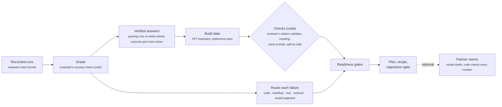

# customization-planner

An MCP agent that answers a question partners ask about every agent that almost works: **should we fine-tune the
model?** It reads the agent's recorded runs, sends each failure to the cheapest fix that can hold it, builds
supervised fine-tuning (SFT) examples and preference pairs (for DPO, direct preference optimization) only where code
can verify the right answer, and says which readiness gates that data passes.

It serves the third JD2Agent role ([Senior Solutions Architect, Agentic AI](../../roles/agentic-ai-solutions-architect/role_spec.yaml)),
workflow W3: the posting's model customization and post-training asks (tasks T6, T7 and T9). Running the training
itself stays with the person and the partner's GPUs (T8); the agent supplies the data, the recipe and the gate the
tuned model must pass.

## How it works



- **Fix order** ([`fix_routes.yaml`](resources/fix_routes.yaml)): a safety failure or forbidden action goes to a code
  guardrail; tool errors, loops and skipped steps go to the workflow; misused tools go to the tool interface;
  missing evidence goes to retrieval. Only a wrong decision made **with the evidence in context** is model judgment,
  and only that route can lead to training. A fine-tuned model makes a failure less likely; code makes it impossible.
- **A training target must be verifiable by code.** Pass/fail comes from the evaluator's check of the terminal action.
  On an approve task every criterion must be met or waived, so passing runs pin each criterion down. On other tasks
  one criterion does not decide the outcome, so a changed finding there is counted as unverifiable and left out.
- **Data is rebuilt on today's prompt** with the reviewer's own code (policy parser, context assembly, proposer
  prompt), and the rebuilt context is checked against what the trace says the model saw. Every target passes the
  reviewer's own citation validator; any unmasked identifier drops the example.
- **Split by task**, never by example: one held-out task per expected outcome, so the regression gate can see a model
  that drifts toward approving.

## Result on real traces (offline)

Input: the five recorded live runs of [`prior-auth-reviewer`](../prior-auth-reviewer/) (60 traces, model output
from `anthropic:claude-sonnet-5-5`, identifiers masked). The planner itself is code and uses no model, so this run
is deterministic. Full output: [`examples/prior-auth-live/`](examples/prior-auth-live/) (plan, datasets, recipe).

| | Result |
|---|---|
| Traces graded | 60; 58 pass, 0 safety failures (same as the evaluator's reports) |
| Rebuilt prompt context matches the trace | 55 of 55 traces with a proposal |
| Failing runs | 2 (`pa-live-full-2`, PA-001 and PA-006), both routed to model judgment |
| Model decisions that differ from the verified answer | 6, all "C4 unknown" where the verified answer is "met", evidence in context every time |
| Changed decisions code cannot verify | 1 |
| SFT examples | 53 raw, 9 kept (2 tasks dropped for conflicting targets across runs) |
| Preference pairs | 6 raw, 2 kept (4 duplicates of the same task and decision) |
| **Verdict** | **NOT READY TO TRAIN** |

| Readiness gate | Target | Actual | |
|---|---|---|---|
| Preference pairs (train split) | ≥ 100 | 2 | fail |
| SFT examples (train split) | ≥ 200 | 7 | fail |
| Distinct tasks behind the pairs | ≥ 20 | 2 | fail |
| Held-out tasks | ≥ 3 | 3 | pass |
| Largest expected-outcome share in SFT | ≤ 70% | 71% (approve) | fail |
| No task in both train and eval | 0 | 0 | pass |
| Every expected outcome held out | none missing | none missing | pass |

The gate thresholds are starting points to agree with a partner, not measured constants.

**What it means for the partner.** The one recurring model error is a hedge: the proposer calls "No prior spine
imaging" not enough to establish C4. It appears in 10 of 55 first-pass proposals across 5 tasks, but code can verify
the right answer on only 6 of them (2 tasks). The self-correction round already fixes it, at a measured cost of
22 → 28–30 model calls per 12 cases. Two unique preference pairs cannot teach a model anything it would not overfit.
The answer is "not yet": keep the workflow fix, collect verified cases from at least 20 tasks, and re-run the plan.

## What building it taught

- **Most of the real signal is unverifiable.** Four of the ten hedges sit on tasks whose outcome doesn't pin C4 down.
  Training on them would mean trusting the agent's own later answer as the label, which is the thing being tested.
- **A dataset of passing runs leans toward approval.** 71% of the training examples are approvals. Tuning on that mix
  could push the model toward approving, the unsafe direction, so the balance check is a gate, and every expected
  outcome keeps a held-out task.
- **Traces need the prompt version to become training data.** The first two live runs used an earlier prompt (no list
  of omitted sentences); the traces don't record which prompt produced them, so the planner pairs every recorded
  answer with today's prompt and says so. The reviewer should write the prompt version into each trace.
- **The cheapest fix may be one sentence.** The proposer's system prompt says "when the notes do not clearly establish
  a criterion, say unknown", which plausibly invites the hedge. That is inferred, not tested: a live run with a
  sharper instruction is the next step, before any training.

## Run it

```bash
cd agents/customization-planner
uv sync --extra anthropic --extra dev
uv run python -m unittest discover -s tests -t .
uv run python -m customization_planner.cli plan --plan-id live-5-runs          # no model
export AGENT_EVALUATOR_MODEL="anthropic:claude-sonnet-5-5"                      # or reuse AI_ARCHITECT_MODEL
uv run python -m customization_planner.cli memo --plan-id live-5-runs          # model drafts the partner memo
```

The ai-architect job runner runs these as `cp-tests`, `cp-plan`, `cp-memo` and `cp-probe`.

## MCP surface

| Kind | Name |
|---|---|
| Resources | `cp://routes`, `cp://plans/{plan_id}/{name}` |
| Tools (code) | `list_trace_runs`, `grade_runs`, `route_failures`, `build_datasets`, `check_readiness`, `write_recipe`, `plan_customization` |
| Tools (model) | `draft_partner_memo` |
| Prompt | `plan_model_customization` |

## Output formats

- `sft.jsonl`: one example per line with `system`, `prompt` and `completion` (the proposal JSON the reviewer's
  validator accepts).
- `dpo.jsonl`: `system`, `prompt`, `chosen`, `rejected`, plus the criteria where they differ and where the rejected
  answer came from (`first_pass` corrected by the critic, or a `failing_run`).
- `recipe.yaml`: a LoRA SFT warm start then DPO, with the split and the regression gate. Hyperparameters are starting
  points, not tuned results; the status stays `blocked` until every gate passes.

Other agents plug in with a small adapter like [`prior_auth.py`](customization_planner/prior_auth.py): read the
model's decisions out of a trace and rebuild its prompt.
