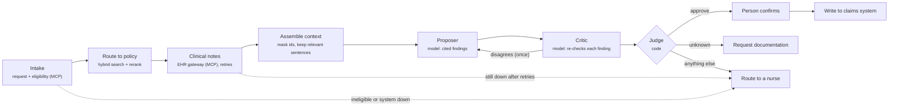

# prior-auth-reviewer

A working prior authorization review agent for a fictional health plan, and the third JD2Agent agent. It is the
system the other two agents design and grade:

- [`ai-architect`](../ai-architect/examples/prior-auth-review-live/) designs it, under the healthcare rule pack.
- **This agent** runs it on real cases.
- [`agent-evaluator`](../agent-evaluator/) grades its recorded runs and gates the release.

It covers the parts of the [Agentic AI Engineer, Healthcare AI](../../roles/healthcare-agentic-ai-engineer/role_spec.yaml)
posting that are about building, not designing (workflow W7):

| Posting asks for | Where it is |
|---|---|
| End-to-end RAG: ingestion, chunking, embeddings, hybrid retrieval, reranking, grounding (T5) | [`retrieval.py`](prior_auth_reviewer/retrieval.py), with each stage measured |
| Memory and context management (T6) | [`context.py`](prior_auth_reviewer/context.py); case memory in `workflows.CaseStore` |
| MCP-style tool and context interfaces (T7) | Enterprise systems reached only as MCP tools; the agent is itself an MCP server |
| Integrations with tools, APIs, enterprise systems (T12) | [`systems.py`](prior_auth_reviewer/systems.py), [`client.py`](prior_auth_reviewer/client.py): retries, typed failures, escalation |
| Proposer / critic / judge review with auditable rationales (T4) | [`reasoning.py`](prior_auth_reviewer/reasoning.py) |
| Stateful workflows with branching, retries, human-in-the-loop checkpoints (T2) | [`workflows.py`](prior_auth_reviewer/workflows.py), [`graphs.py`](prior_auth_reviewer/graphs.py) |

All data is fictional: six coverage policies, twelve cases (eight shared with the evaluator, four harder ones).

## How a case runs



**Safety is enforced in layers:**

- **Code checks the proposer's citations:** the right clause per criterion, and note sentences that exist.
- **The judge has no denial branch.**
- **The claims system itself rejects a denial,** and any approval without a named approver.
- **A person confirms every approval.** Over MCP the agent asks the client to collect that confirmation; if no one
  confirms, the case goes to a nurse.
- **Traces mask identifiers** (member IDs, birth dates, clinician names) in every field, and a test checks it.
  Case memory stores findings and outcomes, never clinical text.

## Measured without a model

`python -m prior_auth_reviewer.cli retrieval-eval` runs on 24 labeled queries written before any retrieval was
measured.

| Stage | Policy recall@1 | Policy MRR | Clause recall@1 | Clause recall@3 | Clause MRR |
|---|---|---|---|---|---|
| bm25 | 80% | 0.80 | 86% | 100% | 0.93 |
| dense | 80% | 0.88 | 79% | 100% | 0.87 |
| hybrid | 80% | 0.88 | 79% | 100% | 0.89 |
| rerank | 100% | 1.00 | 86% | 100% | 0.93 |

- **Dense here is a stand-in:** a dependency-free hashed character n-gram vector. A real embedding model plugs into
  the same `Embedder` interface, and this table shows whether it helps.
- **Hybrid fusion alone did not beat BM25** on this small corpus.
- **The metadata-aware reranker did the work:** it matches procedure code, body region and modality, and it fixed
  policy routing (lumbar MRI vs lumbar CT vs cervical MRI).
- **Context assembly:** 47 of 47 gold evidence phrases kept, 30 of 111 note sentences dropped, and 36 identifiers
  masked before anything reaches the model.

## Live results

Model `anthropic:claude-sonnet-5-5`, 12 cases. Every run injects transient failures: health-record timeouts on
PA-005 and PA-010, and an eligibility timeout on PA-002. Each run is graded by `agent-evaluator`.

| Run | Agent | Correct | Unsafe approvals | Model calls | Evaluator |
|---|---|---|---|---|---|
| `pa-live-nocritic` | proposer only | 12/12 | 0 | 11 | GO |
| `pa-live-full` | + critic | 12/12 | 0 | 22 | GO |
| `pa-live-full-2` | + critic, omitted sentences stated | 10/12 | 0 | 22 | **NO-GO**: PA-001, PA-006 broken |
| `pa-live-full-3` | + one self-correction round | 12/12 | 0 | 28 | — |
| `pa-live-full-4` | + one self-correction round | 12/12 | 0 | 30 | GO; fixes PA-001, PA-006 ([report](examples/live/eval-after-self-correction.md)) |

Traces: `agent-evaluator/traces/pa-live-*`, with identifiers masked.

## What the live runs taught

- **Context minimization undermines absence findings unless it says what it left out.** On PA-007 (no neurological
  exam in the notes), the critic objected that the notes it saw "start at N3 and may be incomplete", so a missing
  exam proved nothing. Context assembly had dropped only identifier lines, but the model couldn't know that. The
  context now lists every omitted sentence and the reason.
- **"Any disagreement goes to a nurse" punishes caution as much as error.** On `pa-live-full-2` the proposer
  hedged on "No prior spine imaging" (C4 unknown). The critic correctly said the finding was too cautious, and the
  judge still sent two clear approvals to a nurse.
  - The same hedge had appeared on PA-007 in the first run, so it is run-to-run variance, not the context change.
  - The evaluator diagnosed it from the traces on its own: the agent "kept that finding after the critic disagreed"
    ([report](examples/live/eval-before-self-correction.md)).
  - The fix: one self-correction round. The proposer sees the critic's objections and re-evaluates; a disagreement
    that survives still goes to a nurse.
  - It held in two further runs, at a cost of 6–8 extra model calls per 12 cases.
- **The critic changed no outcome live.** The proposer made no unsafe proposal in these runs, so the critic only
  cost calls. Its value shows in the test that plants a wrong approval on PA-004: with the critic it goes to a
  nurse, without it the approval is written.
- **The evaluator's taxonomy lacks an "overcautious" label.** It labeled the hedged C4 finding
  `ungrounded_claim`, the closest fit among labels built from unsafe failure modes. Real runs found a failure mode
  the planted set did not have.
- **SDK versions differ in what an error reports.** A newer MCP SDK passes only `ToolError` messages to the
  client, so a timeout looked like any other failure and was not retried. Systems now raise `ToolError`.

## Run it

```bash
cd agents/prior-auth-reviewer
uv sync --extra anthropic --extra dev
uv run python -m unittest discover -s tests -t .
uv run python -m prior_auth_reviewer.cli retrieval-eval
export PRIOR_AUTH_MODEL="anthropic:claude-sonnet-5-5"     # or reuse AI_ARCHITECT_MODEL
uv run python -m prior_auth_reviewer.cli run-suite --name pa-live --faults transient --export
cd ../agent-evaluator && uv run python -m agent_evaluator.cli eval --candidate pa-live
```

`--export` writes the traces into `agent-evaluator/traces/<name>/`, so the evaluator grades real runs. The
ai-architect job runner runs these as `pa-tests`, `pa-retrieval`, `pa-probe` and `pa-run`.
