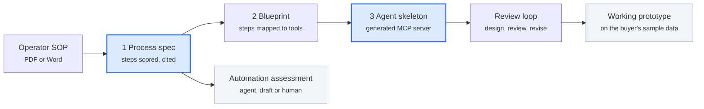

# Phase 5 Plan: SOP to Agent

Phase 5 points JD2Agent at an operator's standard operating procedure (SOP) instead of a job posting. One maintenance
SOP becomes an automation assessment and a working agent prototype in hours, not weeks. The pilot's time goes into
proving it on the buyer's real cases.

## How it works

Blue = new in Phase 5 · plain = reused from JD2Agent · grey = what the buyer gets.

The process spec alone produces the assessment; the prototype ships once the generated design passes the same review
loop that took the architect agent from conditional to go.

## What carries over, and what's new

Most of the pipeline is reused. An SOP is a better input than a job posting: it lists the actual steps, in order, with
the systems and approvals involved.

| Piece | JD2Agent today | SOP version | New work |
| --- | --- | --- | --- |
| Input | Job posting (text, RTF, Word, PDF) | SOP, runbook or work instruction, usually PDF or Word | Small: tables and numbered steps in PDFs |
| Spec | Role spec: tasks scored BUILD / ASSIST / HUMAN | Process spec: steps, decision points, systems, approvals, scored the same way | Medium: new schema and prompt; same quote checks |
| Value score | Five factors, checkability weighted 30% | Same factors plus hours per step × runs per month | Small |
| Safety rule | None needed | Lockout/tagout, permits and physical work are always HUMAN | Small: a rule list, checked by code |
| Blueprint | Hand-checked YAML | Steps mapped to systems (maintenance management, ERP, sensor historian), approval gate on every write | Medium |
| Agent | Hand-built MCP server | Generated MCP server skeleton: tools, knowledge files, prompts, tests | Large: the factory itself |
| Review | 19-rule rulebook, design-review-revise loop | Same rulebook and loop on the generated design | None |

## Build plan

Four steps, each a build-and-test cycle measured in hours with AI-assisted development. A step is done when its gate
passes, not when a date arrives. Step 1 alone is enough to start outreach: the assessment is the pilot's first
deliverable.

| Step | Deliverable | Done when |
| --- | --- | --- |
| 1. SOP → process spec | Parser plus scorer: every step tagged BUILD / ASSIST / HUMAN with hours saved | Runs on 3 publicly available maintenance procedures; every step quotes its SOP line; every safety step comes out HUMAN |
| 2. Process spec → blueprint | Steps mapped to tools and systems, approval gates on writes | Blueprint check passes; no write without a gate |
| 3. Blueprint → agent skeleton | Generator for MCP tools, knowledge files, prompts and tests | Generated server starts, lists its tools and passes its own tests; regenerating the ai-architect agent matches its hand-built structure |
| 4. Mock connectors, first pilot | Mock maintenance-management and sensor-history tools with sample data | One public SOP runs end to end; one paid pilot signed |

## The pilot offer

One SOP and a sample data export in; the assessment and a first prototype back within two working days. The rest of
the pilot is validation on the buyer's real cases, paced by their experts' time. The buyer pays for proof and
expertise, not build hours.

**Who it's for:** VPs of digital transformation, asset operations or engineering at mid-market energy, manufacturing
and oilfield services companies (100–2,000 employees).

| Stage | The buyer provides | They get |
| --- | --- | --- |
| Kickoff | One maintenance, inspection or troubleshooting SOP; an anonymized sample export (work orders, sensor history); a process owner for two one-hour sessions | Data check the same day |
| Build (hours) | Nothing further | Step-by-step assessment: what an agent does, what it drafts, what stays human, estimated hours saved; a first prototype on their sample data |
| Validate (their pace) | Experts test it on recent real cases and flag misses | Fixes in hours after each round; accuracy measured on their cases |
| Decide | A review session | The prototype, its design document and review report, and a recommendation: extend, build in-house, or stop |

If the buyer decides to build in-house, the assessment and design still give their team a running start.

**How to price it.** Price the outcome, not the hours. Building now takes hours, so a fee based on effort undersells
the work and invites the wrong comparison.

- **Anchor on value:** hours saved per run × runs per month × loaded labor cost, using the buyer's own numbers from
  the assessment. A pilot fee equal to a month or two of that value is a starting point to test.
- **Set a floor:** time for kickoff, validation rounds and the decision review, plus model and cloud costs.
- **Charge a fixed fee per pilot, not hourly,** and credit it toward a follow-on build, so saying yes is low-risk.
- **Test before publishing a number:** use the first few conversations to learn what the buyer values most, such as
  hours saved, first-time fixes or audit readiness, and price against that.

## Risks and guardrails

The prototype is the easy part; data access and safety are where pilots fail.

| Risk | Guardrail |
| --- | --- |
| No access to the buyer's live systems during the pilot | Scope the pilot to the SOP plus a sample export; connectors to live systems come after the pilot |
| The agent touches safety-critical work | Lockout/tagout, permits and physical steps are always HUMAN, enforced by code; the agent only drafts, a person approves every write |
| SOPs are outdated or vague | The assessment lists every step it couldn't score and why; that list is itself useful to the buyer |
| Confidential documents | Run in the buyer's cloud account or on anonymized exports; nothing kept after the pilot |
| Savings estimates challenged | Hours saved come from the buyer's own numbers (time per step × runs per month), shown as a range |
| Generated code is fragile | The generator ships tests with every agent, and the same design-review loop gates every design |

## Next actions and open questions

- [ ] Pick 3 publicly available maintenance or troubleshooting procedures as test inputs
- [ ] Build step 1 (SOP → process spec) and run it on all three
- [ ] Turn one result into a sample assessment to attach to outreach
- [ ] Test the offer and the pricing logic with 3 operations leaders before publishing any number

Open questions:

- Which process to lead with: equipment troubleshooting, preventive maintenance or inspection reports?
- Is the buyer's first concern hours saved, first-time-fix rate, or audit readiness?
- Does the pilot run in the buyer's cloud account or on exports only?
